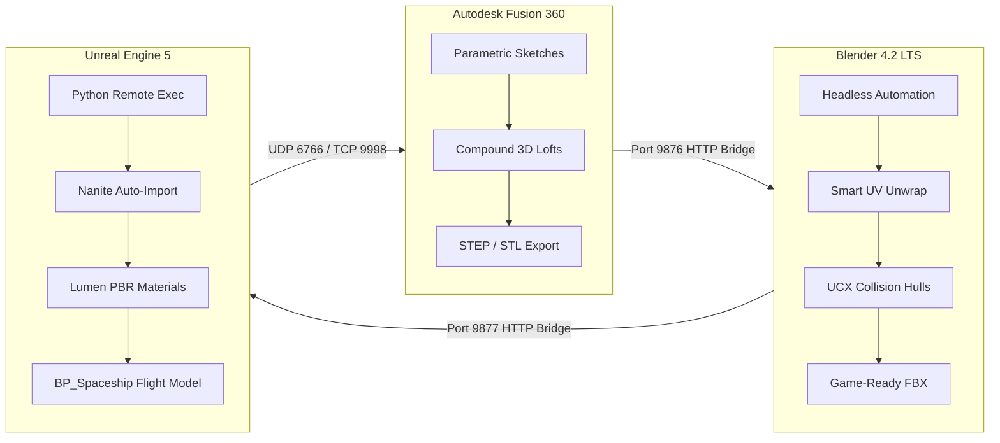

# Project Vanguard 🚀
### Autonomous Sci-Fi 3D Asset Pipeline & Game Production Suite
**Autodesk Fusion 360 (CAD) ➔ Blender 4.2 LTS (UV & Shading) ➔ Unreal Engine 5 (Nanite & Gameplay)**

---

## 🌟 Overview
**Project Vanguard** is a fully automated, $0-cost end-to-end 3D game asset pipeline connecting precision hard-surface CAD engineering with real-time video game production. Designed for high-fidelity sci-fi aerospace fighters and modular game environments, it bridges parametric CAD solids into game-ready Nanite assets with automated UV unwrapping, physics collision hulls, and PBR material setups.



---

## 🏗️ Studio Directory Structure

```text
lucid-davinci/ (Project Vanguard)
├── assets/                       # Official Studio Asset Repository
│   ├── cad/                      # Parametric CAD Solid Models (.step, .stl)
│   │   ├── vehicles/             # Spaceship interceptors, strikecraft, hulls
│   │   └── environment/          # Modular walls, doors, airlocks, docking bays
│   ├── meshes/                   # Game-Ready Tessellated Meshes (.fbx)
│   │   ├── vehicles/             # UV-unwrapped fighters with UCX_ collision
│   │   └── environment/          # 200cm modular grid snap assets
│   └── textures/                 # PBR textures (DirectX Normals, Packed ORM)
├── blender_addon/                # Blender Live Bridge Add-on
│   └── antigravity_bridge/       # Background HTTP server (port 9877) + N-Panel
├── fusion_addin/                 # Autodesk Fusion 360 Live Bridge Add-In
│   └── AntigravityBridge/        # Background HTTP server (port 9876) + CustomEvents
├── data/                         # Studio Data & Game Design Metadata
│   ├── asset_manifest.json       # Master asset catalog, dimensions & sockets
│   └── levels/                   # Procedural level layouts (200cm modular grid)
├── scripts/                      # Generation & Automation Scripts
│   ├── models/                   # Parametric spaceship & environment generators
│   └── unreal/                   # Procedural level generation & actor spawner
└── tools/                        # Antigravity Automation Tool Suite
    ├── asset_factory.py          # Master end-to-end pipeline orchestrator
    ├── fusion_client.py          # Fusion 360 bridge client CLI
    ├── blender_client.py         # Blender 4.2 live bridge client CLI
    ├── ue5_client.py             # Unreal Engine 5 remote execution client
    ├── blender_pipeline.py       # Headless Blender UV & UCX collision generator
    ├── texture_processor.py      # DirectX normal maps & packed ORM processor
    ├── manifest_manager.py       # Asset manifest registry CLI
    ├── level_generator.py        # Procedural 200cm modular level generator
    └── verify_backup.py          # Fast CRC32 backup verification tool
```

---

## 🔌 Live Bridge Ecosystem

| Tool | Port / Protocol | Function |
| :--- | :--- | :--- |
| **Fusion 360 Bridge** | `http://127.0.0.1:9876` | Live parametric CAD modeling & STEP/STL generation |
| **Blender Live Bridge** | `http://127.0.0.1:9877` | Viewport control, automated Smart UVs, physics hulls |
| **Unreal Engine Remote** | `UDP 6766` / `TCP 9998` | Direct asset injection, material creation & level staging |

---

## 🚀 CLI Quick Start

### 1. Test Fusion 360 Connection
```powershell
python tools/fusion_client.py --ping
```

### 2. Test Blender 4.2 Connection
```powershell
python tools/blender_client.py --ping
```

### 3. Generate & Stage an Asset End-to-End
```powershell
python tools/asset_factory.py --name Spaceship_Sculpted_V_Hull --category Vehicles/Fighters
```

### 4. Verify Backup Integrity
```powershell
python tools/verify_backup.py
```

---

## 🛸 Highlight Asset: Spaceship Sculpted V-Hull
- **Classification:** Heavy Strike Interceptor / Superiority Fighter
- **Dimensions:** Length: 10.30m | Wingspan: 9.78m | Height: 2.70m
- **Hull Design:** 7-Station Transverse 3D Lofting with sculpted V-Keel and dual-engine ventral weapons tunnel (0% flat underside).
- **Wing Profile:** 3-Station Compound Spanwise Cambered Dihedral Lofting.
- **Armament:** 4x Hypersonic Interceptor Missiles on wing pylons + Twin Chin Kinetic Autocannons.
- **Avionics:** Ventral FLIR/EOTS Diamond Targeting Pod + Faceted Bronze Canopy.
- **Files:**
  - Master CAD: [`assets/cad/vehicles/Spaceship_Sculpted_V_Hull.step`](assets/cad/vehicles/Spaceship_Sculpted_V_Hull.step)
  - Game-Ready FBX: [`assets/meshes/vehicles/Spaceship_Sculpted_V_Hull.fbx`](assets/meshes/vehicles/Spaceship_Sculpted_V_Hull.fbx)
  - Physics Hull: `UCX_Spaceship_Sculpted_V_Hull`
