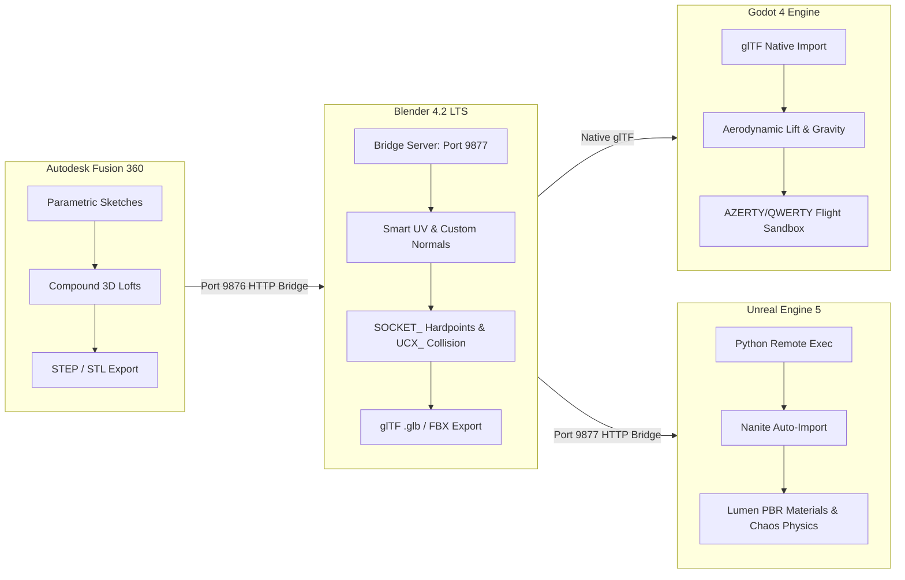

<div align="center">


<br/>


### Autonomous Sci-Fi 3D Asset Pipeline & Combat Flight Simulator
**Precision CAD (Fusion 360) ➔ Blender 4.2 LTS (DCC & Shading) ➔ Godot 4 & Unreal Engine 5**

*"Precision in the Void. Firepower in the Envelope."*

[](docs/lore/README.md)
[](godot_project/)
[](docs/PIPELINE_WORKFLOW.md)
[](docs/lore/README.md)

</div>

---

## 🌟 Overview
**Project Vanguard** is a fully automated, $0-cost end-to-end 3D game asset pipeline connecting precision hard-surface CAD engineering with real-time game engines. Designed for high-fidelity sci-fi aerospace fighters, weapons systems, and modular environments, it bridges parametric CAD solids into game-ready assets with automated UV unwrapping, physics collision hulls, and PBR material setups.



---

## 📚 Technical Documentation

Comprehensive engineering and design documents are available in the [`docs/`](docs/) directory:

* 🌌 **[Worldbuilding & Lore Bible](docs/lore/README.md)**  
  *The Ascension War chronology, Sol Orbital Directorate vs Helion Combine, 404th Vanguard Strike Wing, and diegetic aircraft dossiers.*
* 🎯 **[Campaign Missions (01-04)](docs/lore/CAMPAIGN_MISSIONS.md)**  
  *Detailed combat operations, AWACS dialogue, objective design, and 100% realistic asset feasibility matrix for the first 4 missions.*
* 🎮 **[Tactical HUD & Combat Telemetry](docs/HUD_AND_COMBAT_SYSTEM.md)**  
  *Compass horizon ribbon, 350m circular radar, screen-space target lock, and nitro afterburner mechanics.*
* ✈️ **[Flight Dynamics, Gravity & Controls Guide](docs/CONTROLS_AND_PHYSICS.md)**  
  *Aerodynamic lift equations, stall speed mechanics, 6-DOF rotational steering, and zero-latency AZERTY/QWERTY auto-detection.*
* 🛠️ **[Multi-Engine Asset Pipeline Workflow](docs/PIPELINE_WORKFLOW.md)**  
  *Unit scale normalization rules (mm $\rightarrow$ m $\rightarrow$ cm), forward-vector coordinate mapping, modular `UCX_` collision standards, and PBR material slots.*
* 🚀 **[Weapons, Pylons & Sockets System](docs/WEAPONS_AND_SOCKETS.md)**  
  *CAD specifications for the Vanguard Strike Missile, wing pylon geometry, and engine socket mounting patterns.*

---

## 🏗️ Studio Directory Structure

```text
lucid-davinci/ (Project Vanguard)
├── assets/                       # Official Studio Asset Repository
│   ├── cad/                      # Parametric CAD Solid Models (.step, .stl)
│   │   ├── vehicles/             # Spaceship interceptors, strike missiles, pylons
│   │   └── environment/          # Modular walls, doors, airlocks, docking bays
│   ├── meshes/                   # Game-Ready Tessellated Meshes (.fbx, .glb)
│   │   ├── vehicles/             # UV-unwrapped fighters with UCX_ collision & sockets
│   │   └── environment/          # 200cm modular grid snap assets
│   └── textures/                 # PBR textures (DirectX Normals, Packed ORM)
├── docs/                         # Technical Documentation & Architecture Manuals
│   ├── CONTROLS_AND_PHYSICS.md   # Flight dynamics, lift vs gravity, AZERTY detection
│   ├── PIPELINE_WORKFLOW.md      # Scale, coordinates, materials, collision standards
│   └── WEAPONS_AND_SOCKETS.md    # Missile CAD specs, pylons, and hardpoints
├── godot_project/                # Godot 4 Flight Mechanics Testbed
│   ├── project.godot             # Godot 4 project configuration
│   ├── main.tscn                 # 3D test arena with sky, lighting, ground, and pillars
│   ├── spaceship_controller.gd   # Aerodynamic flight script with AZERTY/QWERTY auto-detect
│   └── hud.gd                    # Realtime flight instruments HUD (Speed, Alt, Stall)
├── blender_addon/                # Blender Live Bridge Add-on (port 9877)
├── fusion_addin/                 # Autodesk Fusion 360 Live Bridge Add-In (port 9876)
├── data/                         # Studio Data & Game Design Metadata
│   ├── asset_manifest.json       # Master asset catalog, dimensions & sockets
│   └── levels/                   # Procedural level layouts (200cm modular grid)
└── tools/                        # Antigravity Automation Tool Suite
    ├── asset_factory.py          # Master end-to-end pipeline orchestrator
    ├── generate_missile_fusion.py# Parametric missile & pylon generator in Fusion 360
    ├── mount_weapons_blender.py  # Weapon mounting & socket integration in Blender
    ├── setup_ue_spaceship.py     # Blender scene preparation for Unreal Engine
    ├── fusion_client.py          # Fusion 360 bridge client CLI
    ├── blender_client.py         # Blender 4.2 live bridge client CLI
    └── ue5_client.py             # Unreal Engine 5 remote execution client
```

---

## 🎮 Playable Flight Controls (Godot 4)

The flight controller automatically detects **AZERTY** (Belgian / French) vs **QWERTY** keyboards upon startup and supports instant toggling via **`F1`**:

| Action | AZERTY | QWERTY | Finger Placement |
| :--- | :--- | :--- | :--- |
| **Throttle Accelerate** | **`Z`** | **`W`** | Middle finger (Top row) |
| **Airbrake / Decelerate** | **`S`** | **`S`** | Middle finger (Home row) |
| **Afterburner Boost** | **`SHIFT`** | **`SHIFT`** | Pinky |
| **Bank / Roll Left** | **`Q`** | **`A`** | Ring finger (Home row) |
| **Bank / Roll Right** | **`D`** | **`D`** | Index finger (Home row) |
| **Yaw / Rudder Left** | **`A`** | **`Q`** | Ring finger (Top row) |
| **Yaw / Rudder Right** | **`E`** | **`E`** | Index finger (Top row) |
| **Pitch & Steering** | **Mouse** | **Mouse** | Right hand |
| **Toggle Mouse Lock** | **`ESC`** | **`ESC`** | Left hand |
| **Switch Layout** | **`F1`** | **`F1`** | Function row |

---

## 🔌 Live Bridge Ecosystem

| Tool | Port / Protocol | Function |
| :--- | :--- | :--- |
| **Fusion 360 Bridge** | `http://127.0.0.1:9876` | Live parametric CAD modeling & STEP/STL generation |
| **Blender Live Bridge** | `http://127.0.0.1:9877` | Viewport control, automated Smart UVs, physics hulls |
| **Godot 4 Testbed** | Subprocess / IPC | Real-time aerodynamics, flight physics & control testing |
| **Unreal Engine Remote** | `UDP 6766` / `TCP 9998` | Direct asset injection, material creation & level staging |

---

## 🛸 Highlight Assets

### 1. Spaceship Sculpted V-Hull
* **Dimensions:** Length: $10.30\text{m}$ | Wingspan: $9.78\text{m}$ | Height: $2.70\text{m}$
* **Hull Design:** 7-Station Transverse 3D Lofting with compound V-Keel and twin-engine ventral weapons tunnel (0% flat underside).
* **Armament:** 4x Wing Pylons equipped with Vanguard Strike Missiles.
* **Avionics:** Dual forward projector headlights + Ventral FLIR/EOTS Diamond Targeting Pod + Faceted Canopy.

### 2. Vanguard Precision Strike Missile
* **Dimensions:** Length: $2.35\text{m}$ | Body Diameter: $18\text{cm}$ | Fin Span: $53\text{cm}$
* **Aerodynamics:** Tangent ogive radome, cruciform supersonic stabilization fins, forward canard guidance fins.
* **Mounting:** Aerodynamic swept pylon adapter flush with wing dihedral.
