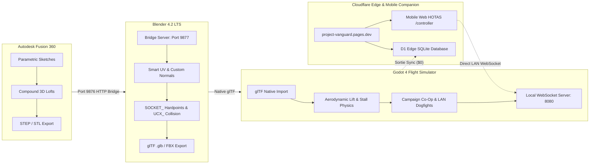

<div align="center">


<br/>


### Autonomous Sci-Fi 3D Asset Pipeline & Combat Flight Simulator
**Precision CAD (Fusion 360) ➔ Blender 4.2 LTS (DCC & Shading) ➔ Godot 4 & Unreal Engine 5**

*"Precision in the Void. Firepower in the Envelope."*

[](https://github.com/bokk3/Vanguard/releases)
[](https://project-vanguard.pages.dev)
[](docs/ZERO_COST_INFRASTRUCTURE_AND_CONTROLLER_SPEC.md)
[](docs/MULTIPLAYER_AND_COOP_SYSTEM.md)
[](docs/SAVE_SYSTEM_AND_PROFILES.md)
[](docs/lore/README.md)

</div>

---

## 🌟 Overview
**Project Vanguard** is a high-octane 3D combat flight simulator and automated end-to-end game asset pipeline connecting precision hard-surface CAD engineering with real-time game engines. 

Pilots fly in single-player sorties across 8 tactical missions, dynamic drop-in split-screen co-op, local head-to-head 1v1 arenas, or low-latency LAN peer-to-peer dogfights. In addition to physical controllers, players can join as wingmen simply by **scanning an on-screen QR code with any smartphone camera**, transforming mobile browsers into motion-steered, haptic-feedback cockpit flight sticks with zero downloads.

All player profiles, campaign saves, and verified global leaderboards run on a **$0-cost cloud infrastructure** powered by Cloudflare Pages Functions and Cloudflare D1 (serverless SQLite at the edge).



---

## 📚 Technical Documentation & System Specifications

Comprehensive engineering and design documents are available in the [`docs/`](docs/) directory:

* 🌐 **[Zero-Cost Infrastructure & Mobile Controller Spec](docs/ZERO_COST_INFRASTRUCTURE_AND_CONTROLLER_SPEC.md)**  
  *Complete blueprint for Cloudflare D1 relational schema, Pages Functions REST APIs, and high-frequency WebSocket protocol for the "Scan-to-Fly" mobile HOTAS.*
* 💾 **[Save System, Sovereign Profiles & Cloud Sync](docs/SAVE_SYSTEM_AND_PROFILES.md)**  
  *Offline-first JSON serialization, HMAC-SHA256 anti-tamper sealing, pilot registration, and client-side web dossier inspector.*
* 🛰️ **[Multiplayer, Split-Screen & Co-Op Architecture](docs/MULTIPLAYER_AND_COOP_SYSTEM.md)**  
  *Campaign drop-in co-op, local split-screen PvP dogfighting, LAN peer-to-peer listen servers, ENet snapshot synchronization, and mobile companion pairing.*
* 🎮 **[Tactical HUD & Combat Telemetry](docs/HUD_AND_COMBAT_SYSTEM.md)**  
  *Compass horizon ribbon, 350m circular radar, screen-space target lock, and nitro afterburner mechanics.*
* ✈️ **[Flight Dynamics, Gravity & Controls Guide](docs/CONTROLS_AND_PHYSICS.md)**  
  *Aerodynamic lift equations, stall speed mechanics, 6-DOF rotational steering, AZERTY/QWERTY detection, and mobile gyro steering.*
* 🌌 **[Worldbuilding & Lore Bible](docs/lore/README.md)**  
  *The Ascension War chronology, Sol Orbital Directorate vs Helion Combine, 404th Vanguard Strike Wing, and diegetic aircraft dossiers.*
* 🎯 **[Campaign Missions (01-08)](docs/lore/CAMPAIGN_MISSIONS.md)**  
  *Detailed combat operations, AWACS dialogue, objective design, and asset feasibility matrix across all 8 campaign missions.*
* 🛠️ **[Multi-Engine Asset Pipeline Workflow](docs/PIPELINE_WORKFLOW.md)**  
  *Unit scale normalization rules (mm $\rightarrow$ m $\rightarrow$ cm), coordinate mapping, modular `UCX_` collision standards, and PBR material slots.*
* 🚀 **[Weapons, Pylons & Sockets System](docs/WEAPONS_AND_SOCKETS.md)**  
  *CAD specifications for the Vanguard Strike Missile, wing pylon geometry, and engine socket mounting patterns.*

---

## 🏗️ Studio Directory Structure

```text
lucid-davinci/ (Project Vanguard)
├── assets/                       # Official Studio Asset Repository
│   ├── cad/                      # Parametric CAD Solid Models (.step, .stl)
│   │   ├── vehicles/             # Spaceship interceptors, strike missiles, pylons
│   │   └── environment/          # Modular walls, doors, airlocks, docking bays
│   ├── meshes/                   # Game-Ready Tessellated Meshes (.fbx, .glb)
│   │   ├── vehicles/             # UV-unwrapped fighters with UCX_ collision & sockets
│   │   └── environment/          # 200cm modular grid snap assets
│   └── textures/                 # PBR textures (DirectX Normals, Packed ORM)
├── docs/                         # Technical Documentation & Architecture Manuals
│   ├── ZERO_COST_INFRASTRUCTURE_AND_CONTROLLER_SPEC.md # D1 & Mobile HOTAS Spec
│   ├── SAVE_SYSTEM_AND_PROFILES.md# Save system, HMAC & Cloud Sync
│   ├── MULTIPLAYER_AND_COOP_SYSTEM.md # Co-Op, LAN Arena & QR Join
│   └── CONTROLS_AND_PHYSICS.md   # Flight dynamics & input routing
├── godot_project/                # Godot 4.7 Combat Flight Mechanics Testbed
│   ├── project.godot             # Project configuration (v0.8.0)
│   ├── main.tscn                 # Campaign sortie arena with dynamic co-op join
│   ├── split_screen_arena.tscn   # Local 1v1 PvP dogfight arena
│   ├── lan_arena.tscn            # LAN peer-to-peer multiplayer dogfight arena
│   ├── spaceship_controller.gd   # 6-DOF aerodynamic flight controller
│   ├── save_manager.gd           # Offline & cloud save state manager
│   └── network_manager.gd        # ENet multiplayer peer & UDP discovery beacons
├── website/                      # Official Web Operations Center (Cloudflare Pages)
│   ├── functions/api/            # Edge API (Auth, Pilot Dossier, Leaderboards)
│   ├── src/                      # Vite 6 + Tailwind CSS frontend
│   ├── controller.html           # "Scan-to-Fly" Mobile Web HOTAS companion
│   └── schema.sql                # Cloudflare D1 serverless SQLite schema
├── tools/                        # Automation & CAD Bridge Tool Suite
│   ├── asset_factory.py          # Master end-to-end pipeline orchestrator
│   ├── fusion_client.py          # Autodesk Fusion 360 bridge client CLI
│   └── blender_client.py         # Blender 4.2 LTS live bridge client CLI
└── data/                         # Studio Data, Mission Manifests & Levels
```

---

## 🎮 Playable Flight Controls (Godot 4)

Project Vanguard supports multiple simultaneous control schemes, automatically switching between **AZERTY** and **QWERTY** layouts:

| Action | Primary (P1) | Wingman (P2 Split-Screen) | Mobile Web HOTAS (QR Scan) |
| :--- | :--- | :--- | :--- |
| **Steering (Pitch / Roll)** | Mouse or `W`/`S` + `A`/`D` | `NumPad 8/2` + `4/6` or `I/K` + `J/L` | Virtual Thumbstick / Gyro Tilt |
| **Throttle / Airbrake** | `Z`/`S` (AZERTY) or `W`/`S` | `Y` (Throttle) / `H` (Airbrake) | Continuous Throttle Slider |
| **Afterburner Nitro** | `Left Shift` | `N` or `NumPad 0` | Boost Detent Button |
| **Rudder / Yaw** | `A`/`E` (AZERTY) or `Q`/`E` | `U` (Rudder L) / `O` (Rudder R) | On-Screen Rudder Bar |
| **Fire Machine Gun** | `Space` / Left Mouse Button | `Enter` / `NumPad Enter` or `M` | Primary Fire Trigger (Haptic) |
| **Fire Strike Missile** | `R` / Right Mouse Button | `P` or `NumPad +` | Missile Release Button |
| **Switch AZERTY/QWERTY**| `F1` | `F1` | Automatic |
| **Toggle Split Layout** | `F2` (Horizontal $\leftrightarrow$ Vertical) | `F2` | Automatic |

---

## 📱 "Scan-to-Fly" Mobile Cockpit Companion

Friends can join local co-op or dogfights without needing a second physical controller:
1. Start a sortie or open the LAN arena.
2. The game displays a dynamic QR code on screen.
3. Your friend points their phone camera at the screen and taps the link to open `https://project-vanguard.pages.dev/controller`.
4. The mobile browser connects directly to your PC over local WiFi with **sub-5ms response time**.
5. The phone screen turns into a sci-fi cockpit HOTAS with motion steering and haptic vibrations!

---

## 🛸 Highlight Assets

### 1. Spaceship Sculpted V-Hull
* **Dimensions:** Length: $10.30\text{m}$ | Wingspan: $9.78\text{m}$ | Height: $2.70\text{m}$
* **Hull Design:** 7-Station Transverse 3D Lofting with compound V-Keel and twin-engine ventral weapons tunnel (0% flat underside).
* **Armament:** 4x Wing Pylons equipped with Vanguard Strike Missiles.
* **Avionics:** Dual forward projector headlights + Ventral FLIR/EOTS Diamond Targeting Pod + Faceted Canopy.

### 2. Vanguard Precision Strike Missile
* **Dimensions:** Length: $2.35\text{m}$ | Body Diameter: $18\text{cm}$ | Fin Span: $53\text{cm}$
* **Aerodynamics:** Tangent ogive radome, cruciform supersonic stabilization fins, forward canard guidance fins.
* **Mounting:** Aerodynamic swept pylon adapter flush with wing dihedral.
