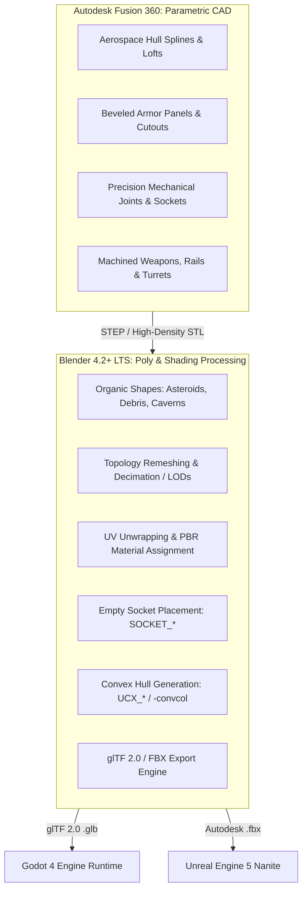

# 🛠️ Project Vanguard: 3D Asset Generation & Mission Technical Specification
**A Comprehensive Production & Modeling Guide for AI Agents and 3D Technical Artists**

---

## 📋 Document Purpose & How to Use This Guide
This document serves as the **authoritative master specification** for generating, processing, and integrating 3D assets (using **Autodesk Fusion 360** and **Blender 4.2+ LTS**), as well as implementing all 8 sorties across **Chapter 1 ("Planetary Ascent")** and **Chapter 2 ("Belt Invasion")** of *Project Vanguard*.

> [!IMPORTANT]
> **For the Coder Agent:**
> - Follow the unit scale conventions, forward-vector orientations, socket schemas, and collision conventions strictly.
> - All asset filenames, bone/empty hierarchies, and material slot names must match this specification to guarantee automated loading in Godot 4 and Unreal Engine 5.
> - For programmatic generation, use Blender headless Python (`blender -b --python <script.py>`) or Fusion 360 Python API scripts as defined in Section 3.

---

## 1. 🏭 CAD vs. DCC Tooling Matrix: Fusion 360 vs. Blender

Project Vanguard uses a **hybrid dual-pipeline** combining parametric engineering CAD with polygonal digital content creation (DCC).



### When to Generate in Fusion 360:
- **Hard-Surface Aerospace Craft:** Smooth lofted aerodynamic fuselages, supersonic chine edges, stealth faceted profiles.
- **Machined Mechanisms:** Sentry gun mounts, gimbal swivels, missile pylons, landing skids, carrier catapult guide tracks, heavy railgun spires.
- **Precision Mechanical Shells:** Torpedo warhead casings, cylindrical fuel pods, structural bulkhead frames.
- **Export Format:** Export from Fusion as **STEP AP214/AP242** (preserves analytical curves) or high-density binary **STL/OBJ** with fine angular tolerance ($\le 0.05\text{ mm}$ chordal deviation).

### When to Generate in Blender:
- **Organic & Geological Environments:** Irregular asteroid boulders, jagged impact clusters, porous cavern rock tunnels.
- **Parametric / Modifier Meshing:** Volumetric displacement, procedural Voronoi cratering, array-instanced tether chains.
- **Post-CAD Retopology & Optimization:** Quad-remeshing, weighted normal smoothing, UV unwrapping (Smart UV / Seam UV).
- **Engine Preparation:** Collision mesh generation (`UCX_` hulls), socket markers (`SOCKET_*`), material slot unification, export to Godot-ready `.glb` and UE5-ready `.fbx`.

---

## 2. 📐 Universal Scales, Vectors, and Socket Standards

| Standard | Autodesk Fusion 360 | Blender 4.2+ LTS | Godot 4.x (glTF 2.0) | Unreal Engine 5 (FBX) |
| :--- | :--- | :--- | :--- | :--- |
| **Units** | Millimeters ($mm$) | Meters ($m$) | Meters ($m$) | Centimeters ($cm$) |
| **Forward Vector** | $+Y$ | $+Y$ (Nose) | **$-Z$** (Native glTF) | **$+X$** (Roll Axis) |
| **Up Vector** | $+Z$ | $+Z$ (Canopy) | **$+Y$** (Sky) | **$+Z$** (Zenith) |
| **Right Vector** | $+X$ | $+X$ (Starboard) | **$+X$** (Starboard) | **$+Y$** (Starboard) |
| **Coordinate System**| Right-Handed | Right-Handed | Right-Handed | Left-Handed |

### Transformation & Conversion Rules:
1. **Fusion $\to$ Blender:** Fusion exports at $1\text{ unit} = 1\text{ mm}$. When importing into Blender, apply a uniform scale factor of $0.001$ (`Scale = (0.001, 0.001, 0.001)`) and run **Apply Object Transforms** (`Ctrl+A -> All Transforms`).
2. **Blender $\to$ Godot 4 (.glb):** Blender's glTF 2.0 exporter automatically handles the coordinate conversion from Blender ($+Y$ Forward, $+Z$ Up) to glTF 2.0 ($-Z$ Forward, $+Y$ Up). Do NOT invert axes manually before export.
3. **Collision Shapes:**
   - **Godot 4:** Append `-convcol` to create an auto-convex collision shape (e.g., `Mesh_Hull-convcol`), or `-colonly` for invisible static collision walls.
   - **Unreal Engine 5:** Create convex hulls named `UCX_<BaseMeshName>_<01..99>`.
4. **Hardpoint Sockets (`SOCKET_*`):**
   - Implemented in Blender as Empty objects (Display: Single Arrow or Plain Axes) parented to the root mesh.
   - UE5 FBX Importer converts these to mesh sockets automatically.
   - In Godot, these import as `Node3D` child instances.

---

## 3. 📦 Master 3D Asset Catalog & Modeling Specifications

Below is the complete catalog of all assets required across the campaign, detailing their modeling tool, polycount budget, collision hierarchy, material slots, and socket configurations.

### 3.1 Player Craft & Allied Fleet

#### A. F-77 Sculpted V-Hull Interceptor (Player Airframe)
- **Primary Tool:** Fusion 360 (CAD Lofting) $\to$ Blender (UV & Sockets).
- **Target Polycount:** 18,000 – 35,000 triangles (LOD0).
- **Dimensions:** Length: $10.30\text{ m}$, Wingspan: $9.78\text{ m}$, Height: $2.70\text{ m}$.
- **Design Features:** Lifting-body delta with negative-canted twin vertical stabilizers, faceted stealth cockpit canopy, twin 2D thrust-vectoring nozzle petals, four ventral recessed weapon bays.
- **Material Slots:**
  1. `MI_Fighter_Hull`: Carbon-ceramic dark composite ($Metallic=0.88$, $Roughness=0.32$).
  2. `MI_Cockpit_Glass`: Gold-iridium tinted glass ($Transmission=0.85$, $Roughness=0.08$, $Alpha=0.35$).
  3. `MI_Engine_Nozzles`: Heat-treated titanium alloy ($Metallic=0.95$, $Roughness=0.45$, Anisotropic).
  4. `MI_Thruster_Plasma`: Emissive core ($Color=(0.1, 0.6, 1.0)$, $Emission=30.0$).
- **Sockets (`SOCKET_*`):**
  - `SOCKET_Camera_Cockpit`: `(0.0, 1.85, 0.72)`
  - `SOCKET_Camera_Chase`: `(0.0, -8.50, 2.80)`
  - `SOCKET_Thruster_L`: `(-0.95, -4.75, -0.05)`
  - `SOCKET_Thruster_R`: `(0.95, -4.75, -0.05)`
  - `SOCKET_Pylon_L1`: `(-2.40, -0.20, -0.35)`
  - `SOCKET_Pylon_L2`: `(-3.60, -0.80, -0.30)`
  - `SOCKET_Pylon_R1`: `(2.40, -0.20, -0.35)`
  - `SOCKET_Pylon_R2`: `(3.60, -0.80, -0.30)`
  - `SOCKET_Gun_Nose`: `(0.0, 4.80, -0.20)`
- **Collision Structure:** 4x convex hulls: Fuselage, Wing_L, Wing_R, Canopy.
- **File Path:** `godot_project/Spaceship_Sculpted_V_Hull.glb`

#### B. Viper Supreme Interceptor (Wingman Miller / Helion Ace)
- **Primary Tool:** Fusion 360 $\to$ Blender.
- **Target Polycount:** 15,000 – 25,000 triangles.
- **Dimensions:** Length: $11.50\text{ m}$, Wingspan: $8.20\text{ m}$, Height: $2.90\text{ m}$.
- **Design Features:** Forward-swept wings, twin dorsal intake scoops, tandem canopy, aggressive needle nose.
- **Livery Variants:**
  - *Allied (Miller):* Dark Navy with Directorate Blue wing stripes.
  - *Adversary (Crimson Ace):* Matte Obsidian with Blood-Orange high-G leading-edge panels.
- **File Path:** `godot_project/assets/meshes/vehicles/Spaceship_Viper_Supreme_HD.fbx`

#### C. SOC Dauntless Fleet Super-Carrier (Capital Ship)
- **Primary Tool:** Fusion 360 (Superstructure CAD) $\to$ Blender (Detailing & Sockets).
- **Target Polycount:** 65,000 – 120,000 triangles.
- **Dimensions:** Length: $480.0\text{ m}$, Width: $135.0\text{ m}$, Height: $72.0\text{ m}$.
- **Design Features:** Twin angled flight deck runways with magnetic catapult grooves, heavy elevated command island on starboard side, armored bow ram/prow, 6 clustered fusion exhaust nozzles at stern, ventral docking bay.
- **Material Slots:** `MI_Capital_Plating`, `MI_Flight_Deck_Stripes`, `MI_Bridge_Glass`, `MI_Engine_Superglow`.
- **Sockets (`SOCKET_*`):**
  - `SOCKET_Catapult_1`: `(-25.0, 80.0, 12.0)`
  - `SOCKET_Catapult_2`: `(25.0, 80.0, 12.0)`
  - `SOCKET_Bridge_Camera`: `(38.0, -40.0, 45.0)`
  - `SOCKET_Defense_Turret_01` to `_06`: Point-defense flak mounts.
- **Collision Structure:** Simplified composite compound box colliders: Bow, Center Deck, Island, Stern.
- **File Path:** `godot_project/assets/meshes/vehicles/carrier_soc_dauntless.glb`

---

### 3.2 Enemy Craft & Boss Combatants

#### A. Helion Marauder Drone (Recon / Interceptor)
- **Primary Tool:** Blender (Procedural / SubD).
- **Target Polycount:** 4,000 – 8,000 triangles.
- **Dimensions:** Length: $4.50\text{ m}$, Wingspan: $3.80\text{ m}$, Height: $1.20\text{ m}$.
- **Design Features:** Unmanned autonomous craft. Central crimson sensor eye, twin canted fin stabilizer blades, internal mini-missile bay.
- **Sockets:** `SOCKET_Sensor_Eye`, `SOCKET_Thruster_Center`, `SOCKET_Gun_L`, `SOCKET_Gun_R`.
- **File Path:** Programmed via `godot_project/target_drone.gd`.

#### B. Dreadnought Nemesis-9 (Chapter 2 Boss Flagship)
- **Primary Tool:** Fusion 360 (Guns & Armor Slabs) $\to$ Blender (Greebling & Assembly).
- **Target Polycount:** 80,000 – 150,000 triangles.
- **Dimensions:** Length: $620.0\text{ m}$, Width: $180.0\text{ m}$, Height: $95.0\text{ m}$.
- **Design Features:** Brutalist, angular wedge silhouette. Forward protruding twin super-railgun spires ($120\text{ m}$ barrel length), recessed dorsal shield trench with 2 generator nodes, 6 secondary flak turret blisters, heavily protected rear reactor exhaust port.
- **Breakable Sub-Components (Exported as separate hierarchy nodes):**
  - `Shield_Pylon_Alpha` & `Shield_Pylon_Beta`: Destroyable shield emitters.
  - `Flak_Turret_01` through `Flak_Turret_06`: Rotatable twin-barrel turrets with yaw/pitch bones.
  - `Exhaust_Reactor_Core`: Vulnerable glowing core interior with thermal shielding doors.
- **File Path:** `godot_project/assets/meshes/vehicles/dreadnought_nemesis9.glb`

#### C. Heavy Anti-Ship Torpedo
- **Primary Tool:** Fusion 360 (Lathe & Fins).
- **Target Polycount:** 1,800 – 3,500 triangles.
- **Dimensions:** Length: $6.80\text{ m}$, Diameter: $1.10\text{ m}$, Fin Span: $2.20\text{ m}$.
- **Design Features:** Cylindrical missile hull, ogive tip warhead with glowing plasma rings, 4 folding planar grid fins at tail, pulse-detonation thruster bell.
- **Material Slots:** `MI_Torpedo_Hull` (Industrial Hazard Yellow/Dark Charcoal), `MI_Warhead_Glow` (Pulsing Red $Emission=20.0$).
- **Sockets:** `SOCKET_Thruster`, `SOCKET_Detonation_Apex`.
- **File Path:** `godot_project/assets/meshes/vehicles/heavy_anti_ship_torpedo.glb`

---

### 3.3 Ordnance, Turrets & Interactive Defense Props

#### A. VPSM-01 Vanguard Strike Missile
- **Primary Tool:** Fusion 360 $\to$ Blender.
- **Target Polycount:** 1,200 – 2,400 triangles.
- **Dimensions:** Length: $2.40\text{ m}$, Diameter: $0.22\text{ m}$, Wingspan: $0.65\text{ m}$.
- **Sockets:** `SOCKET_Exhaust`, `SOCKET_Seeker_Head`.
- **File Path:** `godot_project/Vanguard_Strike_Missile.fbx`

#### B. Autonomous Laser Sentry Turret
- **Primary Tool:** Fusion 360 $\to$ Blender.
- **Target Polycount:** 3,500 – 6,000 triangles.
- **Dimensions:** Base Diameter: $3.20\text{ m}$, Height: $2.40\text{ m}$.
- **Design Features:** Hemispherical base plate with magnetic anchor prongs, gimbaled yaw ring ($360^\circ$ continuous), dual liquid-cooled optical laser emitter barrels (elevation $-15^\circ$ to $+90^\circ$).
- **Bones / Nodes:** `Bone_Turret_Base` (Yaw), `Bone_Turret_Gimbal` (Pitch).
- **File Path:** `godot_project/assets/meshes/environment/laser_sentry_turret.glb`

#### C. Proximity Tether-Mine
- **Primary Tool:** Blender (Modifiers: Displace + Bevel).
- **Target Polycount:** 2,000 – 4,000 triangles.
- **Dimensions:** Spherical Core: $1.80\text{ m}$ diameter, Spikes: $3.20\text{ m}$ tip-to-tip.
- **Design Features:** Jagged metallic core with 6 magnetic sensor horns, central blinking proximity light, dangling quantum tether wire.
- **File Path:** `godot_project/assets/meshes/environment/asteroid_tether_mine.glb`

---

### 3.4 Environment & Space Obstacles

#### A. Medium Asteroid Boulder
- **Primary Tool:** Blender (IcoSphere subdivided + procedural Voronoi & Musgrave displacement).
- **Target Polycount:** 2,500 – 6,000 triangles.
- **Dimensions:** Average diameter: $25\text{ m} – 45\text{ m}$.
- **Collision:** Simplified 32-face convex hull (`-convcol`).
- **File Path:** `godot_project/assets/meshes/environment/asteroid_boulder_medium.glb`

#### B. Large Jagged Asteroid Cluster
- **Primary Tool:** Blender (Composite union of 4-7 intersecting fractured rocky masses).
- **Target Polycount:** 8,000 – 18,000 triangles.
- **Dimensions:** Span: $120\text{ m} \times 85\text{ m} \times 90\text{ m}$.
- **Collision:** Compound multi-convex collider or trimesh static collider (`-colonly`).
- **File Path:** `godot_project/assets/meshes/environment/asteroid_cluster_large.glb`

#### C. Cavern Trench Tunnel Segment (Modular)
- **Primary Tool:** Blender (Extruded octagonal cylinder with interior rocky displacement).
- **Target Polycount:** 6,000 – 12,000 triangles per $100\text{ m}$ segment.
- **Dimensions:** Length: $100.0\text{ m}$, Inner Clearance: $35.0\text{ m}$ wide $\times 28.0\text{ m}$ high.
- **Design Features:** Hollow interior tunnel with rock ribs, industrial conduit mounts along ceiling, landing ledges.
- **Collision:** Static Concave Trimesh Collider (`-colonly`) for inner flight clearance.
- **File Path:** `godot_project/assets/meshes/environment/cavern_tunnel_straight.glb`

#### D. Cavern Geothermal Generator Core
- **Primary Tool:** Fusion 360 (Cylinder CAD) $\to$ Blender (Piping & Lighting).
- **Target Polycount:** 6,000 – 10,000 triangles.
- **Dimensions:** Core Diameter: $8.0\text{ m}$, Total Frame: $16.0\text{ m} \times 16.0\text{ m} \times 24.0\text{ m}$.
- **Design Features:** Hexagonal stabilization frame, glowing plasma cooling chamber, 4 coolant pipe inputs.
- **File Path:** `godot_project/assets/meshes/environment/cavern_generator_core.glb`

#### E. Modular Sci-Fi Wall / Jamming Tower
- **Primary Tool:** Blender $\to$ Game Ready FBX.
- **Dimensions:** $2.0\text{ m} \times 0.4\text{ m} \times 3.0\text{ m}$ modular block snap, stackable up to $45\text{ m}$ antenna arrays.
- **File Path:** `godot_project/assets/meshes/environment/Modular_SciFi_Wall_01_game_ready.fbx`

---

## 4. 🎮 Complete 8-Mission Campaign Specification

The campaign comprises two 4-mission chapters progressing from low-altitude planetary atmospheric warfare to hard-vacuum deep space carrier ops.

```
CHAPTER 1: PLANETARY ASCENT (Atmospheric Dynamics: stall_speed_ms = 25.0)
  ├── M01: CLOUDBURST         (Low-Altitude Cloud Familiarization & Drone Intercept)
  ├── INT_M01_M02             (Cutscene: Red Sinks Canyon Descent)
  ├── M02: IRON CANYON        (Radar Masking Low-Altitude Strike Run)
  ├── INT_M02_M03             (Cutscene: The Catapult at Dawn)
  ├── M03: APEX LIFTOFF       (Catapult Ascent Escort & Swarm Dogfight)
  ├── INT_M03_M04             (Cutscene: The Karman Zenith)
  ├── M04: STRATOSPHERE ZERO  (High-Apogee Ace Duel)
  └── EPILOGUE_CH1            (Cutscene: Orbital Transition to the Void)

CHAPTER 2: BELT INVASION (Hard Vacuum Dynamics: stall_speed_ms = 0.0)
  ├── INT_M04_M05             (Cutscene: Into the Asteroid Belt)
  ├── M05: SILENT ORBIT       (Tether-Mine Clearance & Stealth Ambush)
  ├── INT_M05_M06             (Cutscene: The Iron Hollow)
  ├── M06: GHOST REEF         (Cavern Trench Run & Generator Sabotage)
  ├── INT_M06_M07             (Cutscene: Distress in the Dark)
  ├── M07: DAUNTLESS DEFENDER (Fleet Super-Carrier Escort & Torpedo Intercept)
  ├── INT_M07_M08             (Cutscene: The Celestial Forge)
  ├── M08: NEXUS CRUCIBLE     (Nemesis-9 Dreadnought Boss Climax)
  └── EPILOGUE_CH2            (Cutscene: Campaign Epilogue & Outer Veil Teaser)
```

---

### MISSION 01: OPERATION "CLOUDBURST"
- **Code / Title:** `M01` // `CLOUDBURST`
- **Chapter / Theater:** Chapter 1 // Sub-Cloud Interception Sector 07 (Apex-Zero Base)
- **Skybox & Atmosphere:** Overcast gray storm clouds, low sunlight slit, heavy turbulence, cloud ceiling $2,800\text{ m}$.
- **Flight Model:** Atmospheric Lift/Stall Active (`stall_speed_ms = 25.0`, `max_speed_ms = 180.0`).
- **Narrative Context:** Helion Combine autonomous scout drones probe equatorial launch corridors during scheduled maintenance of automated SAM batteries. Vanguard 1 is scrambled from the catapult into the soup.
- **Objectives:**
  - *Primary 1:* Launch from catapult, level out above stall speed ($>25\text{ m/s}$).
  - *Primary 2:* Acquire and splash 4x Helion Recon Drones (`target_drone.gd`).
  - *Secondary:* 100% missile accuracy (no wasted Fox Three ordnance).
  - *Bonus:* Complete sortie in under 90 seconds.
- **Entity Spawns:**
  - `Player`: `(0, 500, 0)` heading North.
  - `4x Helion Drones`: Spaced along vector `(0, 550, -600)` to `(200, 650, -1200)`.
- **Assets Used:** `Spaceship_Sculpted_V_Hull.glb`, `Vanguard_Strike_Missile.fbx`.
- **Radio Comms Highlights:**
  - Catapult launch clearance by AWACS Apex.
  - Aegis-7 AI radar lock confirmation tone.
  - Post-splash RTB confirmation.
- **Scoring Thresholds:** S-Rank: $<75\text{s}$ & $100\%$ Hits // Target Score: $4,500\text{ pts}$.

---

### MISSION 02: OPERATION "IRON CANYON"
- **Code / Title:** `M02` // `IRON CANYON`
- **Chapter / Theater:** Chapter 1 // The Red Sinks Canyon Rift Complex
- **Skybox & Atmosphere:** Golden sunset dusk, deep canyon cast shadows, clear skies.
- **Flight Model:** Atmospheric Lift/Stall Active (`stall_speed_ms = 25.0`). High risk of rock wall impact.
- **Narrative Context:** Recon drones deployed automated jamming repeaters along canyon floors, blinding orbital tracking radars. High-altitude SAM batteries prevent high flight; Vanguard 1 must stay below $120\text{ m}$ canyon rim.
- **Objectives:**
  - *Primary 1:* Maintain altitude $<120\text{ m}$ (Terrain masking). Climbing above $180\text{ m}$ for $>5\text{s}$ triggers SAM failure.
  - *Primary 2:* Destroy 3x Helion Jamming Relays built into rock alcoves.
  - *Primary 3:* Eliminate 4x canyon patrol drones.
  - *Secondary:* Destroy all 3 relays using 20mm rotary cannon only.
- **Entity Spawns:**
  - `3x Jamming Towers`: Placed at `(0, 45, -400)`, `(120, 30, -950)`, `(-80, 50, -1500)`.
  - `4x Patrol Drones`: Hovering near relays at altitude $50\text{ m} – 80\text{ m}$.
- **Assets Used:** `Modular_SciFi_Wall_01_game_ready.fbx`, `Spaceship_Sculpted_V_Hull.glb`.
- **Radio Comms Highlights:**
  - Apex warning: *"Keep your belly to the rock."*
  - Aegis-7 radar warning if altitude $>145\text{ m}$.
  - Relays down confirmed.
- **Scoring Thresholds:** S-Rank: $<110\text{s}$, No altitude warnings // Target Score: $6,200\text{ pts}$.

---

### MISSION 03: OPERATION "APEX LIFTOFF"
- **Code / Title:** `M03` // `APEX LIFTOFF`
- **Chapter / Theater:** Chapter 1 // Equatorial Ascension Catapult Corridor
- **Skybox & Atmosphere:** Early dawn twilight, deep indigo zenith, sun bursting over horizon.
- **Flight Model:** Atmospheric (`stall_speed_ms = 25.0`). Ascending flight path.
- **Narrative Context:** Transport Shuttle *Olympus* begins high-speed rocket ascent along the orbital catapult rail. Helion Combine deploys swarm drones to intercept the heavy craft before orbit.
- **Objectives:**
  - *Primary 1:* Escort Shuttle *Olympus* through ascent corridor.
  - *Primary 2:* Intercept 2 attack waves (6 combat drones total) before *Olympus* shield integrity drops to $0\%$.
  - *Secondary:* Maintain *Olympus* shields $>75\%$.
- **Entity Spawns:**
  - `Shuttle Olympus`: Moving along vector `(0, 200, 0)` climbing at $45\text{ m/s}$ along $+Z$ incline.
  - `Wingman Viper (Miller)`: Flying loose starboard escort.
  - `Wave 1 (3 Drones)`: Spawning at `(-300, 600, -800)`.
  - `Wave 2 (3 Drones)`: Diving from `(400, 1200, -600)`.
- **Assets Used:** `Spaceship_Viper_Supreme_HD.fbx`, `Spaceship_Sculpted_V_Hull.glb`.
- **Radio Comms Highlights:**
  - Miller banter: *"Vanguard lead, I've got your six."*
  - Olympus captain voiceover under fire.
  - Swarm cleared callout.
- **Scoring Thresholds:** S-Rank: $<130\text{s}$, Olympus Shields $>85\%$ // Target Score: $7,800\text{ pts}$.

---

### MISSION 04: OPERATION "STRATOSPHERE ZERO"
- **Code / Title:** `M04` // `STRATOSPHERE ZERO`
- **Chapter / Theater:** Chapter 1 Climax // Mesosphere / Karman Line ($45,000\text{ m}$)
- **Skybox & Atmosphere:** Inky black sky with visible stars above, brilliant blue planetary curve below.
- **Flight Model:** Thin Atmosphere Transition (`stall_speed_ms = 18.0`, high inertia drift).
- **Narrative Context:** Helion Combine top ace **Ghost Eye** in a customized crimson Viper interceptor ambushes the flight at the edge of space to decapitate Directorate leadership.
- **Objectives:**
  - *Primary 1:* Ascend into the mesosphere combat theater.
  - *Primary 2:* Defeat Crimson Ace Boss in a 1-on-1 supersonic dogfight.
  - *Secondary:* Avoid taking more than $50$ hull damage.
- **Boss Mechanics (Crimson Ace):**
  - High-G barrel rolls, afterburner displacement, flare countermeasure deployment when missile-locked.
  - Attacks with twin laser burst and high-speed head-on passes.
- **Assets Used:** `Spaceship_Viper_Supreme_HD.fbx` (Crimson Adversary Livery), `Spaceship_Sculpted_V_Hull.glb`.
- **Radio Comms Highlights:**
  - Aegis-7 thin-air aerodynamic warning.
  - Ghost Eye radio challenge: *"Let's see who truly owns the sky."*
  - Ace defeat explosion vocal.
- **Scoring Thresholds:** S-Rank: $<90\text{s}$, Zero hull damage // Target Score: $10,000\text{ pts}$.

---

### MISSION 05: OPERATION "SILENT ORBIT"
- **Code / Title:** `M05` // `SILENT ORBIT`
- **Chapter / Theater:** Chapter 2 // Gordian Asteroid Belt Rim (Sector 24)
- **Skybox & Atmosphere:** Pitch black void, sharp blinding sun backlight, dense tumbling asteroid screen.
- **Flight Model:** **Hard Vacuum Zero-G** (`stall_speed_ms = 0.0`, continuous inertial drift, RCS thruster rotation).
- **Narrative Context:** Super-Carrier *SOC Dauntless* reaches the asteroid belt rim. Pirate stealth craft have seeded magnetic tether-mines across the carrier's approach vector.
- **Objectives:**
  - *Primary 1:* Clear 4x Tether-Mine clusters (`asteroid_tether_mine.glb`) without proximity detonation.
  - *Primary 2:* Splash 4x Stealth Skirmishers lurking among asteroid shadows.
  - *Secondary:* Detonate all mines with rotary cannon fire (conserve missiles).
  - *Bonus:* Zero collisions with tumbling asteroid boulders.
- **Entity Spawns:**
  - `15x Tumbling Asteroids`: Radii $10\text{ m} – 40\text{ m}$, randomized spin velocities.
  - `4x Tether Mines`: Located at key choke points between asteroid clusters.
  - `4x Stealth Skirmishers`: Cloaked until player approaches within $250\text{ m}$.
- **Assets Used:** `asteroid_boulder_medium.glb`, `asteroid_cluster_large.glb`, `asteroid_tether_mine.glb`.
- **Radio Comms Highlights:**
  - Aegis-7 vacuum online: *"Orbital vacuum confirmed. Aerodynamic stall envelope disengaged."*
  - Miller warning about magnetic clamp mines.
  - Stealth ambush alert.
- **Scoring Thresholds:** S-Rank: $<120\text{s}$, No hull damage from mines // Target Score: $8,500\text{ pts}$.

---

### MISSION 06: OPERATION "GHOST REEF"
- **Code / Title:** `M06` // `GHOST REEF`
- **Chapter / Theater:** Chapter 2 // Hollowed Asteroid 433-Eros Subterranean Smelter
- **Skybox & Atmosphere:** Enclosed asteroid interior, amber smelting lava rivers, industrial fog, warning strobes.
- **Flight Model:** Zero-G Inertial with tight interior obstacle bounds ($35\text{ m}$ clearance tunnel).
- **Narrative Context:** Telemetry reveals the Combine's automated asteroid foundry. Vanguard 1 must dive into the winding excavation trench, destroy 4 automated defense sentry turrets and 2 geothermal generator cores, then escape before collapse.
- **Objectives:**
  - *Primary 1:* Navigate through the $1,200\text{ m}$ interior cavern trench.
  - *Primary 2:* Destroy 4x Laser Sentry Turrets (`laser_sentry_turret.glb`).
  - *Primary 3:* Overload 2x Geothermal Reactor Cores (`cavern_generator_core.glb`).
  - *Primary 4:* Escape cavern within 40 seconds post-overload before trench collapses.
- **Entity Spawns:**
  - `12x Tunnel Segments`: Assembled end-to-end with $15^\circ$ directional turns.
  - `4x Laser Sentry Turrets`: Mounted to tunnel ceiling and walls, firing continuous pulse beams.
  - `2x Generator Cores`: In central smelting cavern chamber.
- **Assets Used:** `cavern_tunnel_straight.glb`, `cavern_generator_core.glb`, `laser_sentry_turret.glb`.
- **Radio Comms Highlights:**
  - Apex: *"Penetrate the trench. Watch your wingtips."*
  - Aegis-7 core instability warning countdown.
  - Afterburner escape callout.
- **Scoring Thresholds:** S-Rank: $<140\text{s}$, Escape with $>15\text{s}$ to spare // Target Score: $9,800\text{ pts}$.

---

### MISSION 07: OPERATION "DAUNTLESS DEFENDER"
- **Code / Title:** `M07` // `DAUNTLESS DEFENDER`
- **Chapter / Theater:** Chapter 2 // Dauntless Escort Fleet Perimeter
- **Skybox & Atmosphere:** Distant planetary nebula, tracer flak curtains lighting up space, carrier searchlights.
- **Flight Model:** Zero-G Fleet Defense Dogfight.
- **Narrative Context:** Retaliating for the foundry destruction, Combine heavy torpedo bombers launch a surprise assault against *SOC Dauntless* while her catapults are cycling.
- **Objectives:**
  - *Primary 1:* Defend *SOC Dauntless* from 3 waves of Heavy Anti-Ship Torpedoes (`heavy_anti_ship_torpedo.glb`).
  - *Primary 2:* Shoot down 6x escort fighters.
  - *Failure Condition:* Carrier hull health reaching $0\%$.
- **Entity Spawns:**
  - `SOC Dauntless Super-Carrier`: Anchored at center `(0, 0, 0)`, firing automated flak.
  - `Wave 1`: 2x Torpedoes incoming from Starboard (`(1500, 100, 400)` at $85\text{ m/s}$).
  - `Wave 2`: 2x Torpedoes + 3 Escorts incoming from Port (`(-1600, -80, 200)`).
  - `Wave 3`: 3x Torpedoes incoming from High Stern (`(0, 800, -1800)`).
- **Assets Used:** `carrier_soc_dauntless.glb`, `heavy_anti_ship_torpedo.glb`, `Spaceship_Sculpted_V_Hull.glb`.
- **Radio Comms Highlights:**
  - Captain Ross: *"All hands, general quarters! Torpedo alarms sounding on all decks!"*
  - Aegis-7 torpedo incoming range countdown.
  - Ross commendation upon fleet victory.
- **Scoring Thresholds:** S-Rank: Carrier Hull $>90\%$, All torpedoes intercepted // Target Score: $11,500\text{ pts}$.

---

### MISSION 08: OPERATION "NEXUS CRUCIBLE"
- **Code / Title:** `M08` // `NEXUS CRUCIBLE`
- **Chapter / Theater:** Chapter 2 Grand Climax // Celestial Forge Shipyard Nexus
- **Skybox & Atmosphere:** Shattered celestial ring structure, intense orange forge glow, plasma arcs.
- **Flight Model:** Multi-phase capital dreadnought strike in hard vacuum.
- **Narrative Context:** Vanguard Squadron tracks the retreat vectors to the Combine's supreme command base—the Celestial Forge. Guarding the station is Warlord Vane aboard the super-dreadnought *Nemesis-9*.
- **Objectives (3-Phase Boss Battle):**
  - *Phase 1 (Shield Trench Run):* Weave past flak batteries and destroy 2x Dorsal Shield Pylons (`Shield_Pylon_Alpha` & `Beta`).
  - *Phase 2 (Subsystem Suppression):* Destroy 6x Heavy Flak Turrets lining the dreadnought's flanks while avoiding the dual spinal railguns.
  - *Phase 3 (Core Decapitation):* Fly into the rear thermal exhaust trench and fire missiles into the exposed Main Reactor Core before Vane completes his hyper-jump charge.
- **Boss Attack Patterns:**
  - Spinal Railguns: Red targeting lasers charge for 3.5s, followed by instantaneous hypersonic slug fire.
  - Flak Screen: Clustered proximity detonations creating damaging flak clouds.
- **Assets Used:** `dreadnought_nemesis9.glb`, `laser_sentry_turret.glb`, `Spaceship_Sculpted_V_Hull.glb`.
- **Radio Comms Highlights:**
  - Warlord Vane challenge broadcast.
  - Aegis-7 shield breach telemetry.
  - Vane final defeat transmission as dreadnought explodes.
- **Scoring Thresholds:** S-Rank: $<210\text{s}$, Phase 3 completed in one run // Target Score: $15,000\text{ pts}$.

---

## 5. 🎬 Narrative Interludes & Cinematic Specifications

All transitions between missions feature an in-engine cinematic sequence rendered with 21:9 letterbox black bars, smooth dynamic 3D camera orbits, typewriter subtitles with audio blips, and narrator voiceover by **Brian** (`en-US-BrianNeural`, pitch: `-3Hz`, rate: `-4%`).

| Cutscene ID | Position | Duration | Narration Audio File | Cinematic Scene Staging |
| :--- | :--- | :--- | :--- | :--- |
| `INT_M01_M02` | Between M01 & M02 | ~18s | `interlude_01_red_sinks.mp3` | Camera descends through cloud layer into the shadow-draped canyon chasm of the Red Sinks. |
| `INT_M02_M03` | Between M02 & M03 | ~18s | `interlude_02_apex_liftoff.mp3` | Sunrise over equatorial launch rail; steam venting as Shuttle Olympus prepares for liftoff. |
| `INT_M03_M04` | Between M03 & M04 | ~19s | `interlude_03_karman_zenith.mp3` | Vanguard 1 soaring past the Karman line; atmospheric blue fades to black stellar space. |
| `EPILOGUE_CH1`| Chapter 1 Finale | ~20s | `epilogue_chapter1_finale.mp3` | Vanguard 1 docks with the orbital transfer ring; Earth curves silently below. |
| `INT_M04_M05` | Between M04 & M05 | ~20s | `interlude_04_asteroid_belt.mp3` | Vanguard 1 in loose formation with the massive *SOC Dauntless* as it slips into the asteroid belt. |
| `INT_M05_M06` | Between M05 & M06 | ~19s | `interlude_05_iron_hollow.mp3` | Tracking shot diving into the glowing thermal fissures of hollow asteroid 433-Eros. |
| `INT_M06_M07` | Between M06 & M07 | ~19s | `interlude_06_distress_dark.mp3` | Red battle lights flare on Dauntless deck; flak barrages light up the void against bombers. |
| `INT_M07_M08` | Between M07 & M08 | ~20s | `interlude_07_celestial_forge.mp3` | Approaching the orbital forge ring; the colossal *Nemesis-9* Dreadnought emerges from shadow. |
| `EPILOGUE_CH2`| Chapter 2 Finale | ~21s | `epilogue_chapter2_finale.mp3` | Supernova explosion of Nemesis-9; Vanguard banks away as an ominous signal pulses from deep space. |

---

## 6. 🤖 Actionable Implementation Guide for the Coder Agent

Follow these exact steps when implementing or generating assets for this specification:

### Phase 1: 3D Asset Creation
1. **For CAD Models (Fighter, Carrier, Dreadnought, Sockets, Guns):**
   - Model the hard-surface components in Fusion 360 using millimeters.
   - Export to STEP or STL.
   - Import into Blender via the bridge pipeline, apply `0.001` scale, assign PBR material slots, create `SOCKET_*` empties, and add `UCX_*` convex hulls.
2. **For Environment & Debris (Asteroids, Caverns, Mines):**
   - Run the headless Blender generator scripts in `scripts/models/` (e.g., `generate_chapter2_assets.py`).
   - Export directly as glTF 2.0 (`.glb`) with embedded normals and material slots into `godot_project/assets/meshes/`.

### Phase 2: Engine Import Pass
Run Godot in headless editor mode so it registers and compiles all `.import` resource files:
```powershell
godot_console --headless --editor --quit --path "godot_project"
```

### Phase 3: Manifest & Script Registration
1. Verify entries in `godot_project/data/campaign_manifest.json`:
   - Every mission (`M01` through `M08`) must define `id`, `code`, `name`, `theater`, `description`, `objectives`, `skybox_preset`, `recon_card`, and `medals`.
2. Ensure `mission_manager.gd` has spawning handlers (`_spawn_m01_entities` through `_spawn_m08_entities`).
3. Ensure `interlude_cutscene.gd` maps cutscene IDs (`INT_M01_M02` through `EPILOGUE_CH2`) to audio files and camera paths.

### Phase 4: Automated Headless Verification
Execute the test harness to verify 100% pass rate:
```powershell
godot_console --headless -s test_campaign_headless.gd --path "godot_project"
```
**Acceptance Criteria:**
- Exit code must be `0`.
- All 8 missions must instantiate and spawn valid entity counts without missing mesh errors.
- All 9 cutscenes must validate audio bindings and camera rigs.
- All 8 mission recon cards must exist and load.
