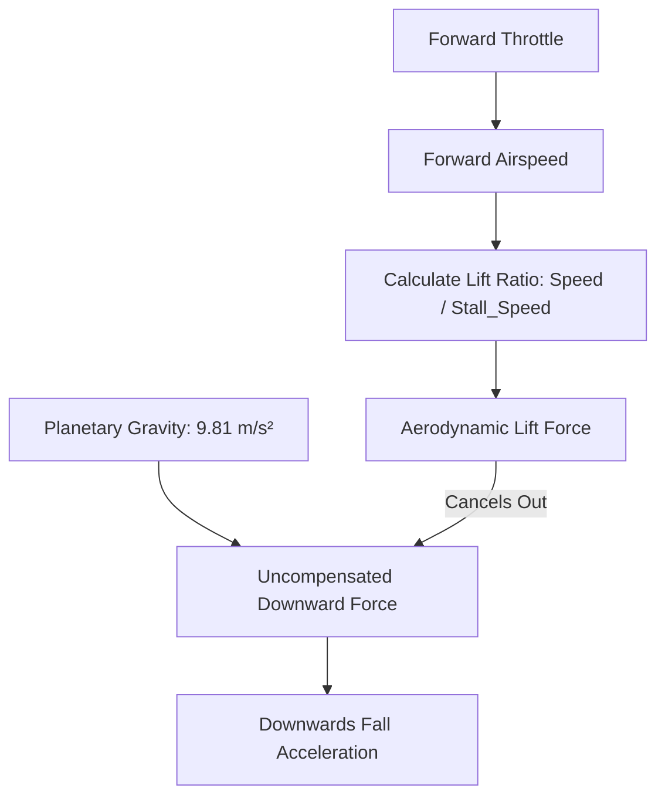

# Project Vanguard: Flight Physics & Control Architecture ✈️

## 1. Overview
The flight model in Project Vanguard is engineered for **arcade combat flight** (similar to *Ace Combat* and *Star Wars: Squadrons*), balancing responsive controls with realistic aerodynamic principles:
* **True 6-DOF rotational steering** (Pitch, Roll, Yaw)
* **Aerodynamic Lift vs. Gravity interaction**
* **Dynamic Stall mechanics** (loss of lift below critical threshold)
* **Intelligent Keyboard Layout Auto-Detection** (AZERTY & QWERTY)

---

## 2. Aerodynamic Lift & Gravity Model

Rather than floating unrealistically in zero-G, atmospheric flight simulates the balance between gravitational acceleration and wing-generated lift.

### The Lift Equation
The effective aerodynamic lift coefficient is calculated continuously:
$$\text{Lift Ratio} = \text{clamp}\left(\frac{\text{Current Airspeed}}{\text{Stall Airspeed}}, 0.0, 1.0\right)$$

$$\text{Downwards Acceleration} = (1.0 - \text{Lift Ratio}) \cdot g$$

### Flight Envelopes:
| Regime | Speed ($m/s$) | Speed ($km/h$) | Lift Ratio | Aerodynamic State |
| :--- | :--- | :--- | :--- | :--- |
| **Cruise** | $60.0\text{ m/s}$ | $216\text{ km/h}$ | $1.0$ ($100\%$) | Steady level flight. Gravity fully countered. |
| **Afterburner** | $120.0\text{ m/s}$ | $432\text{ km/h}$ | $1.0$ ($100\%$) | High-energy combat maneuvering. |
| **Stall Regime** | $< 25.0\text{ m/s}$ | $< 90\text{ km/h}$ | $< 1.0$ (decaying) | **STALL WARNING:** Wings lose lift. Nose pitches down, ship falls towards ground. |
| **Idle / Stop** | $0.0\text{ m/s}$ | $0\text{ km/h}$ | $0.0$ ($0\%$) | Freefall with terminal velocity capped at $60\text{ m/s}$. |

---

## 3. Keyboard Layout Detection (AZERTY vs QWERTY)

### The Problem
On Belgian and French **AZERTY** keyboards:
* The key labeled `W` is located at the bottom-left (where `Z` is on QWERTY).
* The key labeled `A` is at the top-left (where `Q` is on QWERTY).
* If a game expects standard QWERTY WASD, an AZERTY player must awkwardly contort their fingers.

### The Zero-Latency Solution in Vanguard
Project Vanguard implements **three-layer auto-detection** backed by physical keycode fallback:

1. **Windows Registry Query (<1ms):**
   * Checks `HKCU\Control Panel\International\LocaleName`. If it contains `-BE` or `-FR`, switches to **AZERTY**.
   * Inspects `HKCU\Keyboard Layout\Preload` for keyboard language identifiers:
     * `0000080C` (Belgian French AZERTY)
     * `00000813` (Belgian Dutch AZERTY)
     * `0000040C` (French Standard AZERTY)
2. **DisplayServer & OS Locale Fallback:**
   * Reads `DisplayServer.keyboard_get_layout_name()` and `OS.get_locale()`.
3. **Dual Physical & Logical Keycode Mapping:**
   * Inputs check both the localized key (e.g. `KEY_Z` on AZERTY) AND the physical scan position (`KEY_W` physical).
   * **Result:** Hand placement is identical on both keyboard types without finger strain.
4. **On-the-Fly Toggle:**
   * Press **`F1`** at any moment in-game to switch instantly between AZERTY and QWERTY. The HUD updates immediately.

### Keybinding Comparison Table:
| Action | AZERTY Binding | QWERTY Binding | Finger Position |
| :--- | :--- | :--- | :--- |
| **Throttle Up** | **`Z`** | **`W`** | Middle finger (Top row) |
| **Airbrake / Reverse** | **`S`** | **`S`** | Middle finger (Home row) |
| **Bank / Roll Left** | **`Q`** | **`A`** | Ring finger (Home row) |
| **Bank / Roll Right** | **`D`** | **`D`** | Index finger (Home row) |
| **Yaw / Rudder Left** | **`A`** | **`Q`** | Ring finger (Top row) |
| **Yaw / Rudder Right** | **`E`** | **`E`** | Index finger (Top row) |
| **Afterburner Boost** | **`SHIFT`** | **`SHIFT`** | Pinky |
| **Pitch & Steering** | **Mouse** | **Mouse** | Right hand |
| **Toggle Mouse Lock** | **`ESC`** | **`ESC`** | Left hand |
| **Toggle AZERTY/QWERTY** | **`F1`** | **`F1`** | Function row |

---

## 4. Camera Follow Mechanics

The 3rd-person chase camera uses target position interpolation:
$$\vec{P}_{\text{target}} = \vec{P}_{\text{ship}} + (\hat{Z}_{\text{local}} \cdot D) + (\hat{Y}_{\text{local}} \cdot H)$$
Where $D = 14.0\text{ m}$ (distance) and $H = 4.0\text{ m}$ (height).

* **Lag & Lead:** The camera smoothly tracks a look-at point $8.0\text{ m}$ ahead of the nose (`forward_dir * 8.0`), giving a dynamic feeling of speed during high-G turns.
* **Bank Compensation:** When the ship rolls into a boisterous turn, the camera rolls subtly along the ship's local up vector (`global_transform.basis.y`).
