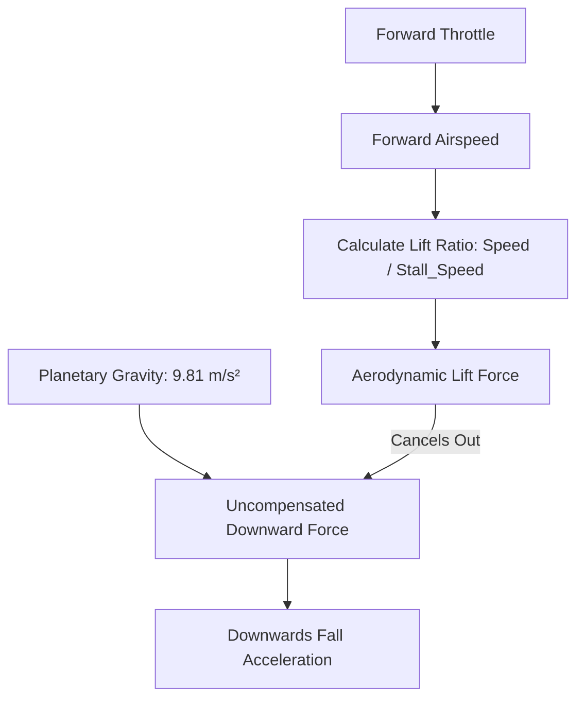

# Project Vanguard: Flight Physics & Control Architecture ✈️

## 1. Overview
The flight model in Project Vanguard is engineered for **arcade combat flight** (similar to *Ace Combat* and *Star Wars: Squadrons*), balancing responsive controls with realistic aerodynamic principles:
* **True 6-DOF rotational steering** (Pitch, Roll, Yaw)
* **Aerodynamic Lift vs. Gravity interaction**
* **Dynamic Stall mechanics** (loss of lift below critical threshold)
* **Intelligent Keyboard Layout Auto-Detection** (AZERTY & QWERTY)

---

## 2. Aerodynamic Lift & Gravity Model

Rather than floating unrealistically in zero-G, atmospheric flight simulates the balance between gravitational acceleration and wing-generated lift.

### The Lift Equation
The effective aerodynamic lift coefficient is calculated continuously:
$$\text{Lift Ratio} = \text{clamp}\left(\frac{\text{Current Airspeed}}{\text{Stall Airspeed}}, 0.0, 1.0\right)$$

$$\text{Downwards Acceleration} = (1.0 - \text{Lift Ratio}) \cdot g$$

### Flight Envelopes:
| Regime | Speed ($m/s$) | Speed ($km/h$) | Lift Ratio | Aerodynamic State |
| :--- | :--- | :--- | :--- | :--- |
| **Cruise** | $60.0\text{ m/s}$ | $216\text{ km/h}$ | $1.0$ ($100\%$) | Steady level flight. Gravity fully countered. |
| **Afterburner** | $120.0\text{ m/s}$ | $432\text{ km/h}$ | $1.0$ ($100\%$) | High-energy combat maneuvering. |
| **Stall Regime** | $< 25.0\text{ m/s}$ | $< 90\text{ km/h}$ | $< 1.0$ (decaying) | **STALL WARNING:** Wings lose lift. Nose pitches down, ship falls towards ground. |
| **Idle / Stop** | $0.0\text{ m/s}$ | $0\text{ km/h}$ | $0.0$ ($0\%$) | Freefall with terminal velocity capped at $60\text{ m/s}$. |

---

## 3. Keyboard Layout Detection (AZERTY vs QWERTY)

### The Problem
On Belgian and French **AZERTY** keyboards:
* The key labeled `W` is located at the bottom-left (where `Z` is on QWERTY).
* The key labeled `A` is at the top-left (where `Q` is on QWERTY).
* If a game expects standard QWERTY WASD, an AZERTY player must awkwardly contort their fingers.

### The Zero-Latency Solution in Vanguard
Project Vanguard implements **three-layer auto-detection** backed by physical keycode fallback:

1. **Windows Registry Query (<1ms):**
   * Checks `HKCU\Control Panel\International\LocaleName`. If it contains `-BE` or `-FR`, switches to **AZERTY**.
   * Inspects `HKCU\Keyboard Layout\Preload` for keyboard language identifiers:
     * `0000080C` (Belgian French AZERTY)
     * `00000813` (Belgian Dutch AZERTY)
     * `0000040C` (French Standard AZERTY)
2. **DisplayServer & OS Locale Fallback:**
   * Reads `DisplayServer.keyboard_get_layout_name()` and `OS.get_locale()`.
3. **Dual Physical & Logical Keycode Mapping:**
   * Inputs check both the localized key (e.g. `KEY_Z` on AZERTY) AND the physical scan position (`KEY_W` physical).
   * **Result:** Hand placement is identical on both keyboard types without finger strain.
4. **On-the-Fly Toggle:**
   * Press **`F1`** at any moment in-game to switch instantly between AZERTY and QWERTY. The HUD updates immediately.

### Keybinding Comparison Table:
| Action | AZERTY Binding | QWERTY Binding | Finger Position |
| :--- | :--- | :--- | :--- |
| **Throttle Up** | **`Z`** | **`W`** | Middle finger (Top row) |
| **Airbrake / Reverse** | **`S`** | **`S`** | Middle finger (Home row) |
| **Bank / Roll Left** | **`Q`** | **`A`** | Ring finger (Home row) |
| **Bank / Roll Right** | **`D`** | **`D`** | Index finger (Home row) |
| **Yaw / Rudder Left** | **`A`** | **`Q`** | Ring finger (Top row) |
| **Yaw / Rudder Right** | **`E`** | **`E`** | Index finger (Top row) |
| **Afterburner Boost** | **`SHIFT`** | **`SHIFT`** | Pinky |
| **Fire Machine Gun** | **`SPACE`** / **Left Click** | **`SPACE`** / **Left Click** | Thumb / Right hand |
| **Fire Guided Missile**| **`R`** / **Right Click** | **`R`** / **Right Click** | Index finger / Right hand |
| **Pitch & Steering** | **Mouse** | **Mouse** | Right hand |
| **Toggle Mouse Lock** | **`ESC`** | **`ESC`** | Left hand |
| **Toggle AZERTY/QWERTY** | **`F1`** | **`F1`** | Function row |
| **Toggle Split-Screen Layout** | **`F2`** | **`F2`** | Horizontal $\leftrightarrow$ Vertical |

---

## 4. Gamepad & Controller Architecture

Project Vanguard supports native XInput, DirectInput, and DualSense controller profiles with calibrated deadzones, exponential stick sensitivity curves, and frequency-split haptic vibration:

| Control | Xbox / Generic Controller | PlayStation DualSense | Function |
| :--- | :--- | :--- | :--- |
| **Pitch & Roll** | Left Thumbstick | Left Thumbstick | Flight surfaces (Pitch $\pm 45^\circ$, Roll $360^\circ$) |
| **Yaw (Rudder)** | Right Thumbstick (X-axis) | Right Thumbstick (X-axis) | Coordinated rudder slip |
| **Throttle Acceleration**| Right Trigger (`RT`) | Right Trigger (`R2`) | Progressive engine thrust ($0.0 \rightarrow 1.0$) |
| **Airbrake / Deceleration**| Left Trigger (`LT`) | Left Trigger (`L2`) | Aerodynamic drag brakes |
| **Afterburner Nitro** | Left Bumper (`LB`) or Click L3 | Left Bumper (`L1`) or Click L3 | High-energy boost ($120\text{ m/s}$) |
| **Fire Machine Gun** | Right Bumper (`RB`) | Right Bumper (`R1`) | Dual rotary cannons ($600\text{ RPM}$) |
| **Fire Strike Missile**| `A` Button | `Cross (X)` Button | Guided missile release from wing rack |
| **Pause Sortie** | `Start` / `Menu` | `Options` | Tactical pause overlay |

---

## 5. Multiplayer & Split-Screen Input Routing

When playing in **Local Split-Screen PvP** or **Campaign Drop-In Co-Op**, the engine separates Player 1 and Player 2 inputs across hardware devices:

### Dual-Controller Setup (Recommended)
- **Controller 1 (`device 0`)**: Automatically drives **Player 1** (Lead Flight Element).
- **Controller 2 (`device 1`)**: Automatically drives **Player 2** (Wingman / Aggressor).

### Single-Keyboard Split Setup
When sharing a single keyboard without gamepads, Player 2 utilizes the secondary right-hand key cluster:

| Flight Action | Player 1 (Left Hand) | Player 2 (Right Hand / NumPad) |
| :--- | :--- | :--- |
| **Pitch Up / Down** | `Mouse Y` or `W`/`S` | `NumPad 8` / `NumPad 2` or `I` / `K` |
| **Roll Left / Right** | `A` / `D` (or `Q` / `D`) | `NumPad 4` / `NumPad 6` or `J` / `L` |
| **Yaw Rudder** | `Q` / `E` (or `A` / `E`) | `U` / `O` |
| **Throttle Up / Down** | `Z` / `S` (or `W` / `S`) | `Y` / `H` |
| **Afterburner Nitro** | `Left Shift` | `N` or `NumPad 0` |
| **Fire Machine Gun** | `Space` / `Left Click` | `Enter` / `NumPad Enter` or `M` |
| **Launch Missile** | `R` / `Right Click` | `P` or `NumPad +` |

### Campaign Dynamic Drop-In Join
In the single-player campaign, pressing any secondary control key (`Enter`, `I`, `K`, `J`, `L`, or any button on Gamepad 2) immediately joins Player 2 as the wingman, partitioning the display into dual viewports sharing the simulation world.

---

## 6. Mobile Web HOTAS & Gyroscope Flight Control 📱

In addition to physical gamepads and keyboards, Project Vanguard accepts flight telemetry directly from smartphones running the web companion (`https://project-vanguard.pages.dev/controller`):

### Touch HOTAS Mapping
* **Virtual Flight Stick (Left Thumb)**: Continuous 2D analog vector for pitch and roll.
* **Continuous Throttle Slider (Right Thumb)**: $0\%$ to $100\%$ linear thrust with afterburner detent above $90\%$.
* **Primary Trigger**: Continuous photon cannon salvo with mobile haptic pulse.
* **Secondary Trigger**: Missile lock-on and release.

### Gyroscope & Motion Flight Steering
When motion control is enabled, the browser's `DeviceOrientationEvent` maps physical device attitude directly into angular rates:
* **Pitch Axis**: $\beta$ (tilt forward/backwards) $\rightarrow$ Pitch Elevator deflection.
* **Roll Axis**: $\gamma$ (tilt left/right) $\rightarrow$ Aileron roll rate.
* **Auto-Centering Neutral Deadzone**: $5^\circ$ neutral resting angle to prevent accidental drift when resting hands comfortably.

---

## 7. Camera Follow Mechanics

The 3rd-person chase camera uses target position interpolation:
$$\vec{P}_{\text{target}} = \vec{P}_{\text{ship}} + (\hat{Z}_{\text{local}} \cdot D) + (\hat{Y}_{\text{local}} \cdot H)$$
Where $D = 14.0\text{ m}$ (distance) and $H = 4.0\text{ m}$ (height).

* **Lag & Lead:** The camera smoothly tracks a look-at point $8.0\text{ m}$ ahead of the nose (`forward_dir * 8.0`), giving a dynamic feeling of speed during high-G turns.
* **Bank Compensation:** When the ship rolls into a boisterous turn, the camera rolls subtly along the ship's local up vector (`global_transform.basis.y`).
* **Multi-Viewport Independent Cams:** In split-screen mode, `CameraP1` and `CameraP2` are isolated in independent `SubViewport` nodes, each dynamically chasing its respective aircraft without cross-camera jitter or transform bleeding.

