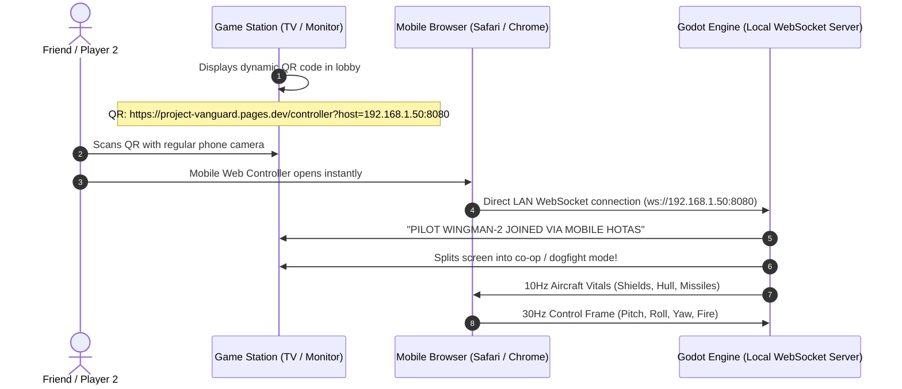

# Project Vanguard: Multiplayer, Split-Screen & Co-Op Architecture 🛰️

## 1. Overview

Project Vanguard features a multi-tiered multiplayer and co-operative flight combat framework built natively within Godot 4.7.2. Designed for instantaneous low-latency dogfights and shared narrative campaign sorties, the system delivers three distinct game modes:

1. **Campaign Drop-In Split-Screen Co-Op**: Single-player campaign sorties allow a secondary pilot to seamlessly join in progress as a wingman upon pressing secondary controls.
2. **Local Split-Screen Dogfight Arena**: Direct head-to-head 1v1 air combat on a single PC with first-to-5 scoring, dynamic layout toggling (Horizontal $\leftrightarrow$ Vertical), and dual independent HUDs.
3. **LAN Peer-to-Peer / Network Dogfight Arena**: Zero-configuration local area network dogfighting utilizing Godot's high-performance ENet multiplayer peer, background UDP discovery beacons, snapshot interpolation, and synchronized RPC ordnance.

---

## 2. System Architecture

```mermaid
graph TD
    subgraph INPUT [Hardware Input Routing]
        P1_In[Gamepad 0 / Primary Keyboard] --> LeadShip[Spaceship P1: Lead]
        P2_In[Gamepad 1+ / Secondary Keyboard] --> WingShip[Spaceship P2: Wingman / Aggressor]
    end

    subgraph ENGINE [Godot 4 Rendering & World3D]
        World[Shared World3D: Terrain, Enemies, Lighting]
        VP1[SubViewport 1: Player 1 Camera + HUD1]
        VP2[SubViewport 2: Player 2 Camera + HUD2]
        World --> VP1
        World --> VP2
    end

    subgraph NETWORK [ENet & UDP Discovery Engine]
        BeaconServer[UDP Beacon Broadcaster: Port 7778]
        BeaconClient[UDP Beacon Listener: Port 7778]
        ENetServer[ENet Listen Server: Port 7779]
        ENetClient[ENet Remote Client: Port 7779]
        BeaconServer -.->|Broadcast LAN Ping| BeaconClient
        BeaconClient -->|Auto-Connect| ENetClient
        ENetClient <==>|RPCs & Net Snapshot 20Hz| ENetServer
    end
```



---

## 3. Campaign Drop-In Split-Screen Co-Op

### Dynamic Join Verification
Single-player campaign sorties (`main.tscn` / `main.gd`) start in full-screen single-player mode. The engine does **not** split the screen until Player 2 actively verifies readiness via secondary controls:
* **Gamepad Input**: Any button or thumbstick deflection ($> 0.6$) on `device >= 1`.
* **Secondary Keyboard Cluster**: `I`, `J`, `K`, `L`, `U`, `O`, `Y`, `H`, `N`, `M`, `P`, `Enter`, `NumPad Enter`, or NumPad directional keys (`8`, `2`, `4`, `6`, `5`, `7`, `9`, `0`).
* **Configured Actions**: Any event mapped to `P2_ACTIONS` in [`config_manager.gd`](file:///c:/Users/Boris/Documents/antigravity/lucid-davinci/godot_project/config_manager.gd).

### Dynamic Viewport Partitioning & World3D Sharing
Upon keypress verification:
1. `join_player_2()` instantiates `SpaceshipP2` with `player_id = 2`, `is_split_screen = true`, and `pvp_mode = false`.
2. A runtime `CoopSplitLayer` (`CanvasLayer` on `layer = 1`) is created with two `SubViewportContainer`s.
3. Both `SubViewport`s are assigned `sub_viewport.world_3d = get_world_3d()`, enabling both pilots to interact with the exact same physics entities (canyon walls, drones, nav pylons, capital ships) without duplicate rendering overhead or physics desync.
4. Independent `Camera3D` and `TacticalOverlay` HUD nodes are bound to each viewport. The single-player full-screen HUD is hidden.
5. AWACS transmission is dispatched: *"Vanguard-2 has joined the battlespace. Wingman formation established."*

### Formation Spawn & Visual Livery
* **Spawn Offset**: Player 2 spawns at `ship_p1.global_position + (right * 22.0) - (fwd * 6.0)` aligned with Player 1's heading and matched to their current airspeed.
* **Livery Customization**:
  - In PvP mode, Player 2 is rendered with **Crimson Aggressor** accents (`Color(1.0, 0.15, 0.1)`).
  - In Co-Op Campaign, Player 2 is rendered with **Solar Amber / Gold Wingman** accents (`Color(1.0, 0.72, 0.08)`) with matching amber engine exhaust glow.

### Dynamic Threat AI Engagement
Hostile AI ([`target_drone.gd`](file:///c:/Users/Boris/Documents/antigravity/lucid-davinci/godot_project/target_drone.gd) and [`boss_combine_ghost.gd`](file:///c:/Users/Boris/Documents/antigravity/lucid-davinci/godot_project/boss_combine_ghost.gd)) dynamically evaluate proximity to all active flight elements in group `"player"`. Drones acquire and lead whichever living player is closest, providing natural combat threat distribution.

### 5-Second Wingman Field Repair Loop
* If a wingman suffers catastrophic airframe failure, the sortie does **not** fail.
* A 5-second repair countdown displays on the downed pilot's HUD while the survivor receives an emergency alert.
* Upon timer expiration, the destroyed craft respawns in formation near the surviving wingman with fully replenished shields, hull, and missiles.
* **Fail Condition**: If **both** aircraft are lost simultaneously, the sortie terminates with `SORTIE_WIPED`.

---

## 4. Local Split-Screen PvP Dogfight Arena

The dedicated split-screen dogfight arena (`split_screen_arena.tscn` / `split_screen_arena.gd`) provides high-stakes local 1v1 competition:
* **Victory Condition**: First pilot to achieve **5 confirmed kills**.
* **Orientation Toggle (<kbd>F2</kbd>)**:
  - **Horizontal Split**: Top (Player 1) / Bottom (Player 2) — ideal for 16:9 widescreen monitors.
  - **Vertical Split**: Left (Player 1) / Right (Player 2) — ideal for ultra-wide displays.
* **Mutual Lock-On**: Both fighters belong to groups `"player"`, `"radar_targets"`, and `"enemies"`, allowing full missile radar lock-on against each other.
* **Kill Banners**: Real-time kill tracking with dynamic combat toasts: `// VANGUARD-1 SPLASHED HOSTILE // [3 / 5] //`.

---

## 5. LAN Peer-to-Peer & Network Architecture

Project Vanguard implements an autonomous listen-server network model with zero router port forwarding required on local networks:

### UDP Auto-Discovery Protocol (Port 7778)
[`network_manager.gd`](file:///c:/Users/Boris/Documents/antigravity/lucid-davinci/godot_project/network_manager.gd) manages background beacon broadcasts using `PacketPeerUDP`:
* When a player selects **Host LAN Game**, the host broadcasts UDP packets every $1.0\text{s}$ containing JSON metadata:
  ```json
  {
    "server_name": "Vanguard-FlightHost",
    "port": 7779,
    "game_mode": "PVP_ARENA",
    "version": "0.8.0"
  }
  ```
* Remote clients listening on UDP port 7778 discover servers automatically and populate the LAN Server Browser without requiring manual IP entry. Direct IP connection (`IP:Port`) is also fully supported.

### ENet High-Performance Multiplayer Peer (Port 7779)
* **Server Role**: The host runs an `ENetMultiplayerPeer` listening on UDP port 7779, serving as the authority for kill adjudication and game state.
* **State Synchronization**: Aircraft position, Euler rotation, velocity, speed, and afterburner boost state are broadcast at 20Hz via `@rpc("unreliable_ordered") func sync_net_state(...)`.
* **Snapshot Interpolation**: Remote aircraft smoothly interpolate incoming state snapshots using Delta-time weighted lerping:
  ```gdscript
  global_position = global_position.lerp(net_target_pos, clamp(20.0 * delta, 0.0, 1.0))
  rotation = rotation.lerp(net_target_rot, clamp(20.0 * delta, 0.0, 1.0))
  ```
* **Synchronized Combat Actions**:
  - Cannon bursts: `@rpc("any_peer", "call_local", "reliable") func rpc_fire_gun_burst()`
  - Guided missile launch: `@rpc("any_peer", "call_local", "reliable") func rpc_fire_missile_net()`
  - Damage & Destruction: `@rpc("any_peer", "call_local", "reliable") func rpc_take_damage_net(dmg, attacker_path)`

---

---

## 6. Input Routing & Hardware Controls

| Control Scheme | Player 1 (Lead Element) | Player 2 (Wingman / Opponent) |
| :--- | :--- | :--- |
| **Primary Gamepad** | Gamepad 1 (`device 0`) | Gamepad 2 (`device 1`) |
| **Haptic Feedback** | Device 0 Dual Motors | Device 1 Dual Motors |
| **Mobile Web Controller** | Web HOTAS / Gyro Steering | Web HOTAS / Gyro Steering (QR Scan) |
| **Keyboard Steering**| Mouse or `W`/`S` + `A`/`D` (or `Z`/`S` + `Q`/`D`) | `NumPad 8/2` + `NumPad 4/6` or `I/K` + `J/L` |
| **Keyboard Throttle**| `Z`/`S` (AZERTY) or `W`/`S` (QWERTY) | `Y` (Throttle Up) / `H` (Airbrake) |
| **Keyboard Rudder** | `A`/`E` (AZERTY) or `Q`/`E` (QWERTY) | `U` (Rudder Left) / `O` (Rudder Right) |
| **Afterburner Nitro**| `Left Shift` | `N` or `NumPad 0` |
| **Fire Cannon** | `Space` / Left Mouse Button | `Enter` / `NumPad Enter` or `M` |
| **Launch Missile** | `R` / Right Mouse Button | `P` or `NumPad +` |
| **Layout Toggle** | `F2` | `F2` |

---

## 7. "Scan-to-Fly" Mobile Web Controller (Zero-Install HOTAS) 📱

To eliminate the "missing controller" barrier for local split-screen co-op and LAN dogfights, Project Vanguard features an autonomous mobile web controller companion:



### Key Highlights:
1. **Zero App Store Downloads**: Runs 100% in the mobile browser (`https://project-vanguard.pages.dev/controller`). No iOS App Store / Google Play downloads needed.
2. **Sub-5ms Direct LAN Latency**: Connects directly to the host PC's local IP via WebSockets. No cloud relays or internet lag.
3. **Motion / Gyroscope Steering**: Tilt the physical phone forward/back for pitch and left/right for roll using `DeviceOrientationEvent`.
4. **Haptic Rumble**: Vibrates the phone upon weapon firing, missile lock, and taking fire using `navigator.vibrate()`.
5. **Secondary Instrument Display**: Real-time HUD gauges (shield %, hull %, missile count, radar warnings) directly in the pilot's palms.

---

## 8. Automated Test Suite

Headless verification for all multiplayer and co-operative systems is integrated into the continuous test harness:

```powershell
# 1. Campaign Drop-In Co-Op Verification
godot_console --headless --path godot_project -s test_campaign_coop.gd

# 2. Local Split-Screen PvP Arena Verification
godot_console --headless --path godot_project -s test_split_screen.gd

# 3. LAN Peer-to-Peer & UDP Discovery Verification
godot_console --headless --path godot_project -s test_pvp_system.gd
```

