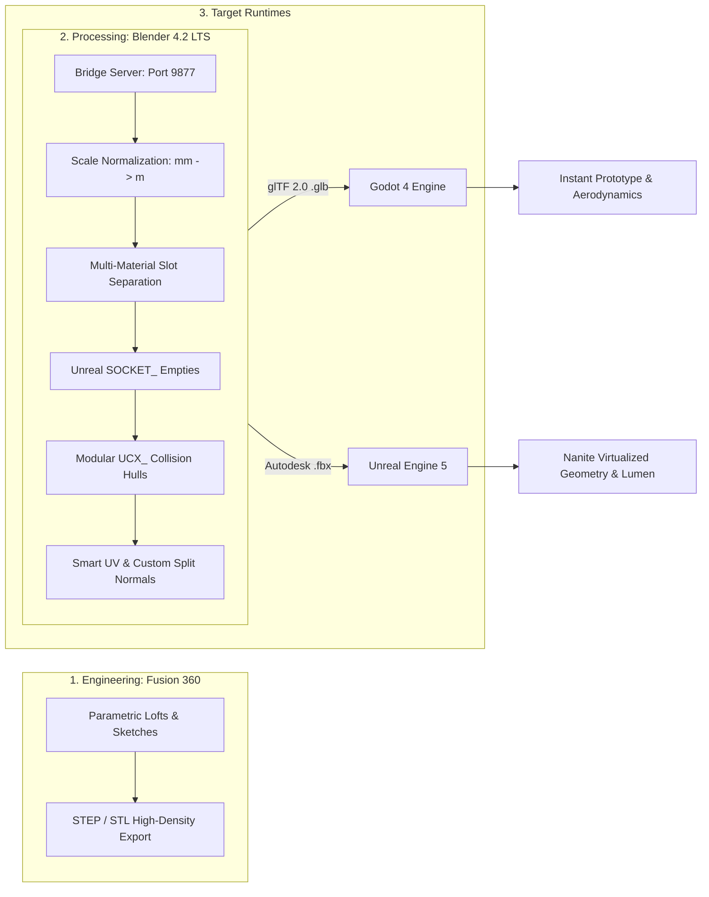

# Project Vanguard: Multi-Engine 3D Asset Pipeline 🛠️

## 1. Overview & Architecture

Project Vanguard bridges high-precision parametric CAD engineering with real-time video game production across two primary game engines: **Godot 4 (Rapid Mechanics Prototyping)** and **Unreal Engine 5 (Nanite & Photorealism)**.



---

## 2. Unit Scales & Coordinate Conventions

One of the most frequent traps in multi-tool 3D pipelines is unit mismatch and forward-vector inversion. Vanguard enforces strict standardization:

| Software | Measurement Unit | Forward Vector | Up Vector | Handedness |
| :--- | :--- | :--- | :--- | :--- |
| **Autodesk Fusion 360** | Millimeters ($mm$) / Centimeters ($cm$) | $+Y$ | $+Z$ | Right-Handed |
| **Blender 4.2 LTS** | Real-World Meters ($m$) | $+Y$ (Nose) | $+Z$ (Canopy) | Right-Handed |
| **Godot 4 (glTF 2.0)** | Real-World Meters ($m$) | **$-Z$** (glTF standard) | $+Y$ (Sky) | Right-Handed |
| **Unreal Engine 5** | Centimeters ($cm$) | **$+X$** | $+Z$ (Sky) | Left-Handed |

### Transformation Rules:
1. **Scale Normalization:**
   * Fusion 360 exports in millimeters ($10,300\text{ mm}$ fighter length).
   * Blender Bridge script detects any mesh dimension $> 150.0$ units and automatically applies a $0.001$ scale multiplier.
   * Final dimensions in meters: $10.30\text{m} \times 9.78\text{m} \times 2.70\text{m}$.
2. **glTF Export for Godot 4:**
   * Handled by Blender's native glTF exporter. Blender's $+Y$ forward is automatically mapped to glTF's standard $-Z$ forward.
3. **FBX Export for Unreal Engine 5:**
   * Handled with `axis_forward='-Z'`, `axis_up='Y'` and `apply_scale_options='FBX_SCALE_ALL'`.

---

## 3. Collision Mesh Standards

High-poly meshes (especially CAD geometry) cause severe CPU performance drops if used directly for physics calculations.

```
Fighter Jet Collision Composition:
├── UCX_Spaceship_Fuselage_01   (Center fuselage & nose)
├── UCX_Spaceship_Wing_L_01     (Left delta wing)
├── UCX_Spaceship_Wing_R_01     (Right delta wing)
└── UCX_Spaceship_Canopy_01     (Cockpit canopy bubble)
```

### Engine-Specific Conventions:
* **Unreal Engine 5:** Recognizes objects named `UCX_<MeshName>_<Index>`. UE5 imports them as convex hulls, automatically hides their visual mesh, and uses them for Chaos Physics.
* **Godot 4:** Recognizes suffixes:
  * `-colonly`: Mesh is hidden and turned purely into a static collision shape.
  * `-convcol`: Generates a convex collision shape from the mesh.

---

## 4. Multi-Material PBR Shading Standards

Vanguard divides vehicles into discrete material slots to avoid monolithic texturing and allow distinct shader effects (emissive thruster glow, translucent glass):

| Material Name | Shader Type | Visual Characteristics |
| :--- | :--- | :--- |
| **`MI_Spaceship_Hull`** | Opaque PBR | Dark military carbon-armor ($Metallic=0.88$, $Roughness=0.32$). |
| **`MI_Cockpit_Glass`** | Translucent Glass | Tinted cyan canopy ($Transmission=0.85$, $Roughness=0.08$, $Alpha=0.35$). |
| **`MI_Headlights`** | High Emissive | Forward projector lenses with emissive glow ($Strength=18.0$, Cyan/White). |
| **`MI_Thrusters`** | High Emissive | Engine afterburner plasma cores ($Strength=25.0$, Cyan/Blue). |
| **`MI_Weapon_Pylon`** | Opaque PBR | Matte dark composite mounting rails ($Metallic=0.90$, $Roughness=0.40$). |

---

## 5. Gameplay Hardpoint Sockets (`SOCKET_*`)

Blender Empty objects prefixed with `SOCKET_` are automatically converted by Unreal Engine's FBX Importer into **Static Mesh Sockets**, and by Godot into `Node3D` attachment markers.

### Spaceship Socket Directory:
| Socket Name | Coordinates ($x, y, z$) in Meters | Function |
| :--- | :--- | :--- |
| `SOCKET_Headlight_L` | `(-1.15, 4.55, 0.28)` | Left forward spotlight projector |
| `SOCKET_Headlight_R` | `(1.15, 4.55, 0.28)` | Right forward spotlight projector |
| `SOCKET_Thruster_L` | `(-0.95, -4.75, -0.05)` | Left engine exhaust Niagara particle emitter |
| `SOCKET_Thruster_R` | `(0.95, -4.75, -0.05)` | Right engine exhaust Niagara particle emitter |
| `SOCKET_Cockpit_Camera`| `(0.00, 1.85, 0.72)` | First-person pilot head / HUD camera |
| `SOCKET_Chase_Camera` | `(0.00, -9.50, 3.20)` | Third-person follow camera anchor |
| `SOCKET_Ventral_Sensor`| `(0.00, 2.75, -0.72)` | Ventral FLIR / target designation gimbal |
| `SOCKET_Weapon_Hardpoint_01` | `(-3.60, -1.80, -0.25)` | Left outer wing missile pylon |
| `SOCKET_Weapon_Hardpoint_02` | `(-2.60, -1.80, -0.25)` | Left inner wing missile pylon |
| `SOCKET_Weapon_Hardpoint_03` | `(2.60, -1.80, -0.25)` | Right inner wing missile pylon |
| `SOCKET_Weapon_Hardpoint_04` | `(3.60, -1.80, -0.25)` | Right outer wing missile pylon |
