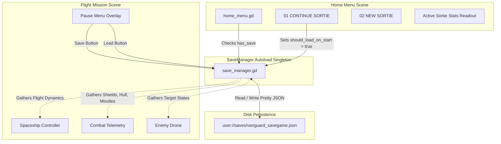

# Vanguard Save Game System & Profile Persistence

Comprehensive technical documentation for the Project Vanguard Save Game System, state serialization, profile management, and semantic versioning strategy.

---

## 1. Storage Location & Accessibility

The save system stores all sortie data in human-readable, indented JSON in an isolated `saves/` directory.

| Context | Path | Notes |
| :--- | :--- | :--- |
| **Godot Virtual Path** | `user://saves/vanguard_savegame.json` | Isolated from config (`user://settings.cfg`) |
| **Windows OS Resolved Path** | `%APPDATA%\Godot\app_userdata\Project Vanguard\saves\vanguard_savegame.json` | Directly accessible in Windows Explorer for backups & modding |
| **Default Slot Name** | `vanguard_savegame` | Expandable to multi-slot profiles (`slot_1`, `slot_2`) |

---

## 2. JSON Save Schema Breakdown

```json
{
  "format_version": 1,
  "game_version": "0.5.0",
  "timestamp": "2026-09-20T05:55:00Z",
  "display_date": "2026-09-20 05:55",
  "profile": {
    "callsign": "VANGUARD-LEAD",
    "squadron": "404th Vanguard Strike Wing",
    "rank": "FLIGHT LIEUTENANT"
  },
  "sortie": {
    "mission_id": "SORTIE_01_RECON_INTERCEPT",
    "mission_title": "Operation Archangel: Low-Orbit Intercept",
    "scene_file": "res://main.tscn"
  },
  "ship": {
    "position": [0.0, 42.5, -80.0],
    "rotation": [0.0, 3.14159, 0.0],
    "current_speed": 140.0,
    "downward_velocity": 0.0
  },
  "telemetry": {
    "current_shield": 85.0,
    "current_hull": 100.0,
    "current_nitro": 92.4,
    "is_overheated": false,
    "overheat_timer": 0.0,
    "missiles_remaining": 3
  },
  "world": {
    "drone_alive": true,
    "drone_state": {
      "angle": 1.45,
      "health": 75.0,
      "global_pos": [-120.0, 75.0, -320.0]
    }
  }
}
```

---

## 3. Core Architecture



---

## 4. UI Integrations

### Home Menu (`res://home_menu.tscn`)
* Automatically checks `SaveManager.has_save()`.
* When a save exists:
  * Reveals **`[ 01 ] CONTINUE SORTIE`** button (styled with glowing primary cyan border).
  * Prompts **`[ 02 ] NEW SORTIE`** as second option.
  * Sidebar status box dynamically displays:
    `ACTIVE SORTIE: 2026-09-20 05:55`
    `HULL INTEGRITY: 85%`
    `MISSILES ARMED: 3/4`
* When no save exists:
  * Displays **`[ 01 ] DEPLOY SORTIE`** directly.

### Tactical Pause Menu (`res://pause_menu.tscn`)
* Pressing `ESC` during flight opens the tactical pause dialog.
* **`[ 02 ] SAVE SORTIE`**:
  * Calls `SaveManager.save_game()`.
  * Triggers an animated tactical confirmation toast:
    `// SORTIE SAVED // SECURE SYNC COMPLETE` in tactical neon green.
  * Enables the **`[ 03 ] LOAD LAST SAVE`** button immediately.
* **`[ 03 ] LOAD LAST SAVE`**:
  * Calls `SaveManager.apply_save_to_current_scene()`.
  * Instantly restores position, speed, vitals, and ordnance, unpausing the simulation.

---

## 5. Semantic Versioning Strategy

Project Vanguard follows [Semantic Versioning 2.0.0](https://semver.org/):
* **MAJOR**: Incompatible architectural milestones or engine conversions (e.g., Godot -> UE5 port).
* **MINOR**: New gameplay features, UI overhauls, or subsystems (e.g., `v0.5.0` Save Game System).
* **PATCH**: Bug fixes, control adjustments, or visual polish.

### Version Single Source of Truth
1. Root `VERSION` file: `0.5.0`
2. Project Configuration: `config/version="0.5.0"` in `godot_project/project.godot`
3. Engine Runtime: Retrieved via `ProjectSettings.get_setting("application/config/version")`
4. Changelog: Tracked in `CHANGELOG.md` following [Keep a Changelog](https://keepachangelog.com/).

---

## 6. Unreal Engine 5 Conversion Blueprint

When porting to Unreal Engine 5:
* `SaveManager` (`Node`) maps to a custom `USaveGame` subclass (e.g. `UVanguardSaveGame`).
* File storage handled via `UGameplayStatics::SaveGameToSlot` and `UGameplayStatics::LoadGameFromSlot`.
* Telemetry variables map directly into `UCombatTelemetryComponent`.
