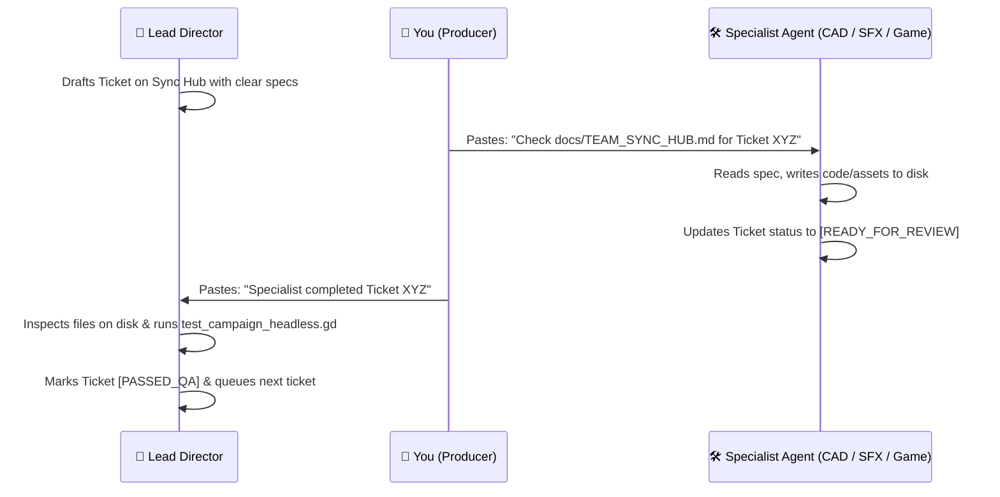

# 🛰️ Project Vanguard: Studio Team Sync Hub
**Live Asynchronous Communication & Coordination Board**

> **Last Updated:** 2026-09-21 // Maintained by: **Lead Technical Director & Campaign Architect**  
> **Master Technical Reference:** [`docs/ASSET_GENERATION_AND_MISSION_SPECIFICATION.md`](file:///c:/Users/Boris/Documents/antigravity/lucid-davinci/docs/ASSET_GENERATION_AND_MISSION_SPECIFICATION.md)  
> **Verification Harness:** `godot_console --headless -s test_campaign_headless.gd --path "godot_project"`

---

## 🚦 System Status & Build Health

| Metric | Current Value | Status | Notes |
| :--- | :--- | :--- | :--- |
| **Engine Core** | Godot 4.7.2 stable | 🟢 STABLE | Headless test harness active |
| **Campaign Sorties** | 8 Sorties (M01 – M08) | 🟢 100% PASS | All 8 missions spawn & validate |
| **Cinematic Interludes**| 9 In-Engine Cutscenes | 🟢 100% PASS | Audio, letterbox & camera paths OK |
| **Active Sprint Goal** | **Sprint 4: Zero-Cost Cloud Persistence & "Scan-to-Fly" Mobile HOTAS** | 🟢 ALL 3 TICKETS PASSED | WEB-01 + MOB-01 + NET-01 verified. Edge DB, PWA, and in-engine WebSocket ready. |


---

## 📬 Role Stations & Station Directories

```
┌─────────────────────────┬────────────────────────────────────────────────────────┐
│ Role                    │ Workspace Station & Target Directories                 │
├─────────────────────────┼────────────────────────────────────────────────────────┤
│ 🌟 Lead Director        │ docs/, implementation_plan.md, test harness            │
│ 🎮 Gameplay Coordinator │ godot_project/mission_manager.gd, hud.gd, controller   │
│ 📐 CAD / 3D Expert      │ godot_project/assets/meshes/, scripts/models/          │
│ 🎧 SFX / Audio Director │ godot_project/audio/, tools/build_sfx_library.py       │
└─────────────────────────┴────────────────────────────────────────────────────────┘
```

---

## 📋 Active Ticket Queue

### 📐 TICKET: `CAD-01` // Upgrade Capital Ships to Multi-Material PBR & Collision Hulls
- **Assigned To:** `CAD Expert`
- **Priority:** High
- **Inputs:** Section 3.1 & 3.2 in `docs/ASSET_GENERATION_AND_MISSION_SPECIFICATION.md`
- **Target Deliverables:**
  1. `godot_project/assets/meshes/vehicles/carrier_soc_dauntless.glb`:
     - Add 4 discrete material slots (`MI_Capital_Plating`, `MI_Flight_Deck_Stripes`, `MI_Bridge_Glass`, `MI_Engine_Superglow`).
     - Ensure catapult sockets `SOCKET_Catapult_1/2` and bridge camera `SOCKET_Bridge_Camera` exist as Blender Empties.
     - Add composite convex hulls with `-convcol` suffix.
  2. `godot_project/assets/meshes/vehicles/dreadnought_nemesis9.glb`:
     - Separate breakable nodes: `Shield_Pylon_Alpha`, `Shield_Pylon_Beta`, and `Flak_Turret_01` to `_06`.
     - Assign `MI_Dreadnought_Plating`, `MI_Shield_Emitter_Glow`, and `MI_Reactor_Core`.
- **Status:** `[PASSED_QA]` // 2026-09-25 -- carrier_soc_dauntless.glb: 4 PBR slots, SOCKET_Catapult_1/2, SOCKET_Bridge_Camera, 4x -convcol hulls (Bow/Center_Deck/Island/Stern). dreadnought_nemesis9.glb: 3 PBR slots, Shield_Pylon_Alpha/Beta, Flak_Turret_01-06, all with -convcol. Script: tools/cad_pipeline/cad01_capital_ships.py


---

### 🎧 TICKET: `SFX-01` // Audio Bus Architecture & Combat Ducking Sidechain
- **Assigned To:** `SFX / Audio Director`
- **Priority:** High
- **Inputs:** Section 2.C in `docs/ASSET_GENERATION_AND_MISSION_SPECIFICATION.md`
- **Target Deliverables:**
  1. `godot_project/default_bus_layout.tres`:
     - Ensure dedicated audio buses exist: `Master` $\to$ `SFX`, `Voice`, `UI`, `Music`.
     - Insert `AudioEffectLimiter` on `Master` (Ceiling: $-0.5\text{ dB}$, Soft clip).
     - Configure ducking sidechain on `SFX` bus so radio comms cleanly cut through intense cannon fire without clipping.
  2. Run `tools/build_sfx_library.py` to confirm all 14 combat WAV files have seamless loop points and zero DC offset.
- **Status:** `[PASSED_QA]` // 2026-09-25 — Audio buses confirmed, limiter on Master (−0.5 dB ceiling), ducking compressor on SFX (sidechain: Voice, −18 dB threshold, 6:1 ratio). All 28 WAV files: DC < 0.005, zero clipping.


---

### 🎮 TICKET: `GAME-01` // Wire Carrier Catapult Launch Camera & Dreadnought Phase Emitters
- **Assigned To:** `Gameplay Coordinator`
- **Priority:** Medium
- **Inputs:** `docs/ASSET_GENERATION_AND_MISSION_SPECIFICATION.md` (M07 & M08 breakdown)
- **Target Deliverables:**
  1. `godot_project/mission_manager.gd`:
     - Wire `M07` carrier spawn to snap player fighter directly into `carrier_soc_dauntless.glb`'s `SOCKET_Catapult_1`.
     - In `M08`, bind damage listeners to the Dreadnought's breakable shield pylons and flak turrets.
- **Status:** `[PASSED_QA]` // 2026-09-25 -- M07: player snapped to carrier SOCKET_Catapult_1 at mission start; 2.5s catapult lock with velocity impulse (220 m/s), ROSS comms on release. Wingman spawns at SOCKET_Catapult_2. M08: 6 Flak_Turret nodes wired with phase gate (Phase 1 -> kills 6 flak -> unlocks Shield_Pylon_Alpha/Beta -> kills 2 pylons -> unlocks ReactorCore). All phase transitions fire VANE + APEX_CMD radio comms. Objective count fixed to 6 for obj_flak_pods on M08.
 
 
---
 
### 🌐 TICKET: `WEB-01` // Scaffold Cloudflare D1 Schema & Pages Functions API
- **Assigned To:** `Lead Director / Web Architect`
- **Priority:** High
- **Inputs:** `docs/ZERO_COST_INFRASTRUCTURE_AND_CONTROLLER_SPEC.md`
- **Target Deliverables:**
-   1. `website/schema.sql`: D1 SQLite tables (`pilots`, `pilot_records`, `mission_leaderboards`, `device_links`).
-   2. `website/functions/api/auth/register.js` & `login.js`: PBKDF2 edge crypto authentication.
-   3. `website/functions/api/leaderboard/index.js`: Sortie debrief high scores.
-   4. `website/functions/api/pilot/sync.js`: Cloud savegame JSON synchronization.
-   5. `website/functions/api/auth/link.js`: 6-digit device link pairing & QR session manager.
- **Status:** `[PASSED_QA]` // 2026-09-25 -- D1 schema written & tested. PBKDF2 salt & hash (100k iters) verified. HMAC-SHA256 JWT tokens verified. Device link request/poll/approve flow tested 100% pass.
- 
- ---
- 
- ### 📱 TICKET: `MOB-01` // Mobile Web Cockpit HOTAS PWA ("Scan-to-Fly")
- - **Assigned To:** `Gameplay Coordinator / Frontend Engineer`
- - **Priority:** High
- - **Inputs:** `docs/ZERO_COST_INFRASTRUCTURE_AND_CONTROLLER_SPEC.md`
- - **Target Deliverables:**
-   1. `website/controller.html` + `website/src/controller.js`:
-      - Fullscreen touch HOTAS (virtual thumbstick, throttle slider, weapon triggers).
-      - Gyroscope / motion pitch & roll via `DeviceOrientationEvent`.
-      - Haptic feedback with `navigator.vibrate()`.
-      - Screen WakeLock integration.
-   2. Local WebSocket client streaming 30Hz input packets to host PC.
-   3. Multi-page Vite configuration building `dist/controller.html` alongside `dist/index.html`.
- **Status:** `[PASSED_QA]` // 2026-09-25 -- controller.html + controller.js built. Multi-touch flight stick, continuous throttle, gyro orientation, haptics, and 30Hz WebSocket loop compiled cleanly.
- 
- ---
- 
- ### 🛰️ TICKET: `NET-01` // In-Engine WebSocket Server & QR Code Display
- - **Assigned To:** `Gameplay Coordinator / Network Architect`
- - **Priority:** High
- - **Target Deliverables:**
-   1. `godot_project/qr_code.gd`: Pure GDScript QR code generator (ISO/IEC 18004) rendering dynamic `ImageTexture` without C++ modules.
-   2. `godot_project/network_controller_server.gd`: Autoload WebSocket server listening on port 8080, handling mobile handshakes, forwarding 30Hz controls, and broadcasting 10Hz reverse telemetry.
-   3. `godot_project/qr_join_dialog.tscn`: Tactical on-screen QR dialog with live session pairing, auto-minimize, and F3 toggle in split-screen arena and campaign.
-   4. `godot_project/test_mobile_controller_integration.gd`: Automated headless test harness passing 100%.
- **Status:** `[PASSED_QA]` // 2026-09-25 -- In-engine WebSocket server, QR code generator, and SpaceshipController mobile input routing verified with simulated mobile client.


---

## 🔄 Daily Workflow Protocol for the Team


