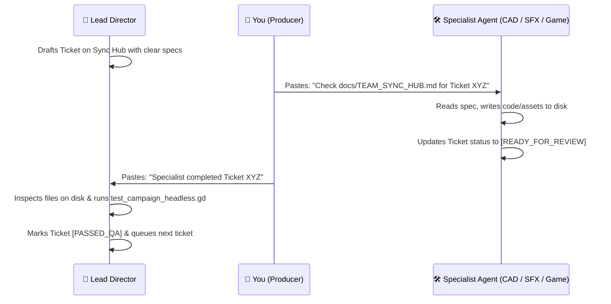

# 🛰️ Project Vanguard: Studio Team Sync Hub
**Live Asynchronous Communication & Coordination Board**

> **Last Updated:** 2026-09-21 // Maintained by: **Lead Technical Director & Campaign Architect**  
> **Master Technical Reference:** [`docs/ASSET_GENERATION_AND_MISSION_SPECIFICATION.md`](file:///c:/Users/Boris/Documents/antigravity/lucid-davinci/docs/ASSET_GENERATION_AND_MISSION_SPECIFICATION.md)  
> **Verification Harness:** `godot_console --headless -s test_campaign_headless.gd --path "godot_project"`

---

## 🚦 System Status & Build Health

| Metric | Current Value | Status | Notes |
| :--- | :--- | :--- | :--- |
| **Engine Core** | Godot 4.7.2 stable | 🟢 STABLE | Headless test harness active |
| **Campaign Sorties** | 8 Sorties (M01 – M08) | 🟢 100% PASS | All 8 missions spawn & validate |
| **Cinematic Interludes**| 9 In-Engine Cutscenes | 🟢 100% PASS | Audio, letterbox & camera paths OK |
| **Recon Briefing Cards**| 8 Cards (M01 – M08) | 🟢 100% PASS | In `godot_project/ui/` |
| **Active Sprint Goal** | **Sprint 3: Asset High-Fidelity Polish & Audio Bus Mixing** | 🟡 IN PROGRESS | Elevating procedural assets to studio grade |

---

## 📬 Role Stations & Station Directories

```
┌─────────────────────────┬────────────────────────────────────────────────────────┐
│ Role                    │ Workspace Station & Target Directories                 │
├─────────────────────────┼────────────────────────────────────────────────────────┤
│ 🌟 Lead Director        │ docs/, implementation_plan.md, test harness            │
│ 🎮 Gameplay Coordinator │ godot_project/mission_manager.gd, hud.gd, controller   │
│ 📐 CAD / 3D Expert      │ godot_project/assets/meshes/, scripts/models/          │
│ 🎧 SFX / Audio Director │ godot_project/audio/, tools/build_sfx_library.py       │
└─────────────────────────┴────────────────────────────────────────────────────────┘
```

---

## 📋 Active Ticket Queue

### 📐 TICKET: `CAD-01` // Upgrade Capital Ships to Multi-Material PBR & Collision Hulls
- **Assigned To:** `CAD Expert`
- **Priority:** High
- **Inputs:** Section 3.1 & 3.2 in `docs/ASSET_GENERATION_AND_MISSION_SPECIFICATION.md`
- **Target Deliverables:**
  1. `godot_project/assets/meshes/vehicles/carrier_soc_dauntless.glb`:
     - Add 4 discrete material slots (`MI_Capital_Plating`, `MI_Flight_Deck_Stripes`, `MI_Bridge_Glass`, `MI_Engine_Superglow`).
     - Ensure catapult sockets `SOCKET_Catapult_1/2` and bridge camera `SOCKET_Bridge_Camera` exist as Blender Empties.
     - Add composite convex hulls with `-convcol` suffix.
  2. `godot_project/assets/meshes/vehicles/dreadnought_nemesis9.glb`:
     - Separate breakable nodes: `Shield_Pylon_Alpha`, `Shield_Pylon_Beta`, and `Flak_Turret_01` to `_06`.
     - Assign `MI_Dreadnought_Plating`, `MI_Shield_Emitter_Glow`, and `MI_Reactor_Core`.
- **Status:** `[QUEUED]` // Ready for CAD Expert pickup

---

### 🎧 TICKET: `SFX-01` // Audio Bus Architecture & Combat Ducking Sidechain
- **Assigned To:** `SFX / Audio Director`
- **Priority:** High
- **Inputs:** Section 2.C in `docs/ASSET_GENERATION_AND_MISSION_SPECIFICATION.md`
- **Target Deliverables:**
  1. `godot_project/default_bus_layout.tres`:
     - Ensure dedicated audio buses exist: `Master` $\to$ `SFX`, `Voice`, `UI`, `Music`.
     - Insert `AudioEffectLimiter` on `Master` (Ceiling: $-0.5\text{ dB}$, Soft clip).
     - Configure ducking sidechain on `SFX` bus so radio comms cleanly cut through intense cannon fire without clipping.
  2. Run `tools/build_sfx_library.py` to confirm all 14 combat WAV files have seamless loop points and zero DC offset.
- **Status:** `[QUEUED]` // Ready for SFX Director pickup

---

### 🎮 TICKET: `GAME-01` // Wire Carrier Catapult Launch Camera & Dreadnought Phase Emitters
- **Assigned To:** `Gameplay Coordinator`
- **Priority:** Medium
- **Inputs:** `docs/ASSET_GENERATION_AND_MISSION_SPECIFICATION.md` (M07 & M08 breakdown)
- **Target Deliverables:**
  1. `godot_project/mission_manager.gd`:
     - Wire `M07` carrier spawn to snap player fighter directly into `carrier_soc_dauntless.glb`'s `SOCKET_Catapult_1`.
     - In `M08`, bind damage listeners to the Dreadnought's breakable shield pylons and flak turrets.
- **Status:** `[QUEUED]` // Ready for Gameplay Coordinator pickup

---

## 🔄 Daily Workflow Protocol for the Team


