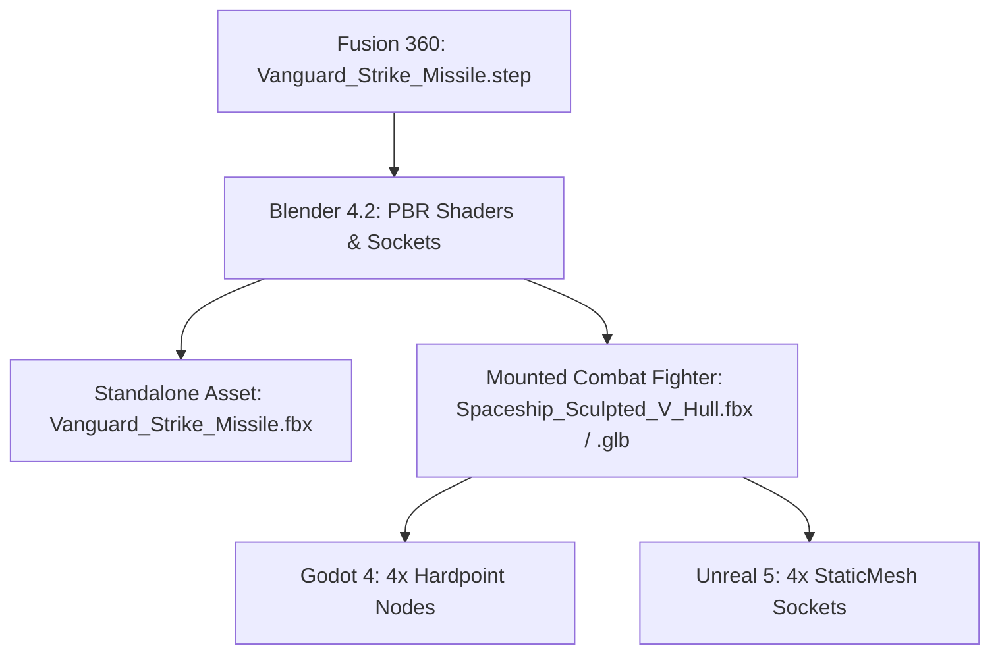

# Project Vanguard: Weapons & Hardpoints System 🚀

## 1. Overview

The weapons system in Project Vanguard consists of high-precision parametric ordnance engineered in **Autodesk Fusion 360**, processed and rigged with collision/sockets in **Blender 4.2 LTS**, and deployable in both **Godot 4** and **Unreal Engine 5**.



---

## 2. Vanguard Precision Strike Missile Specifications

Modeled via [`tools/generate_missile_fusion.py`](file:///c:/Users/Boris/Documents/antigravity/lucid-davinci/tools/generate_missile_fusion.py):

| Dimension / Spec | Metric Measurement | Architectural Detail |
| :--- | :--- | :--- |
| **Total Length** | $2.35\text{ meters}$ ($235\text{ cm}$) | Standard medium-range air-to-air / strike missile. |
| **Fuselage Diameter** | $0.18\text{ meters}$ ($18\text{ cm}$) | Aerodynamic low-drag cylindrical body. |
| **Wingspan (Fins)** | $0.53\text{ meters}$ ($53\text{ cm}$) | Fin-tip to fin-tip cruciform span. |
| **Seeker Radome** | $0.48\text{ meters}$ ($48\text{ cm}$) | Mathematically smooth tangent ogive profile. |
| **Tail Stabilization** | $4\times$ Cruciform Fins | $360^\circ / 4$ Circular pattern with $37\text{ cm}$ root chord. |
| **Canard Guidance** | $4\times$ Forward Fins | Double-wedge supersonic canard steering fins. |
| **Exhaust Cavity** | $\varnothing 10.4\text{ cm} \times 14\text{ cm}$ deep | Recessed nozzle chamber for particle plume emission. |

---

## 3. The Aerodynamic Wing Pylon (`Wing_Pylon_Mount`)

To eliminate unnatural floating weapons, every hardpoint utilizes a dedicated aerodynamic pylon adapter:
* **Dimensions:** Length $1.18\text{ m}$, Height $0.148\text{ m}$, Width $0.052\text{ m}$.
* **Leading Edge:** $45^\circ$ aerodynamic swept angle.
* **Mounting Interface:** Sits flush against the fighter wing's lower dihedral dihedral plane.

---

## 4. Hardpoint Socket Layout

The fighter features 4 standard NATO-style under-wing hardpoints:

```text
               [Cockpit]
                 /   \
        [L2]    /  |  \    [R2]
       [L1]    /   |   \    [R1]
       === Wing L === Wing R ===
```

* **Station 01 (Left Outer):** `(-3.60, -1.80, -0.25)` $\rightarrow$ `SOCKET_Weapon_Hardpoint_01`
* **Station 02 (Left Inner):** `(-2.60, -1.80, -0.25)` $\rightarrow$ `SOCKET_Weapon_Hardpoint_02`
* **Station 03 (Right Inner):** `(2.60, -1.80, -0.25)` $\rightarrow$ `SOCKET_Weapon_Hardpoint_03`
* **Station 04 (Right Outer):** `(3.60, -1.80, -0.25)` $\rightarrow$ `SOCKET_Weapon_Hardpoint_04`

---

## 5. Weapon Launch Implementation Guide

### A. Godot 4 GDScript Weapon Spawning Pattern:
```gdscript
# Example missile launch implementation
func launch_missile(hardpoint_name: String) -> void:
    var socket = find_child(hardpoint_name, true, false)
    if not socket:
        return
    
    # Load standalone missile scene
    var missile_scene = load("res://Vanguard_Strike_Missile.fbx")
    var missile_instance = missile_scene.instantiate()
    
    # Spawn into world root to detach from ship hierarchy
    get_tree().current_scene.add_child(missile_instance)
    missile_instance.global_transform = socket.global_transform
    
    # Inherit launch speed + apply forward rocket impulse
    if missile_instance is RigidBody3D:
        missile_instance.linear_velocity = self.velocity + (-socket.global_transform.basis.z * 150.0)
```

### B. Unreal Engine 5 Blueprint / C++ Pattern:
* Node: `Get Socket Transform` targeting `SM_Spaceship_Sculpted_V_Hull` with Socket Name `SOCKET_Weapon_Hardpoint_01`.
* Node: `SpawnActorFromClass` (`BP_Vanguard_Strike_Missile`) at the retrieved socket transform.
* Attach Niagara particle system to `SOCKET_Missile_Exhaust` for smoke/flame trail simulation.
