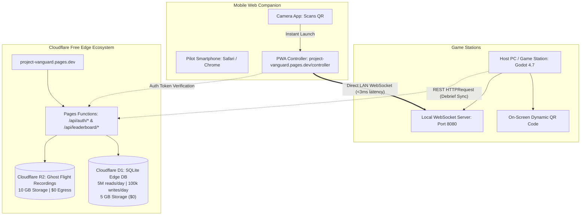

# Project Vanguard: Zero-Cost Cloud Infrastructure & Mobile Web Controller Specification 🌐📱

## 1. Executive Summary

This specification defines two interconnected, high-leverage architectural systems for **Project Vanguard** that operate at **$0.00 infrastructure cost**:
1. **The Sovereign Pilot Cloud Backend**: Zero-cost pilot registration, authentication, cross-PC campaign saves, and verified global leaderboards powered by Cloudflare Pages Functions and Cloudflare D1 (edge SQLite).
2. **The "Scan-to-Fly" Mobile Web Controller (HOTAS Companion)**: Friction-free local multiplayer companion app requiring **no mobile builds or app store downloads**. Players join local split-screen co-op or LAN dogfights simply by scanning an on-screen QR code with any smartphone camera, transforming their mobile browser into a motion-steered, haptic-feedback cockpit flight stick.

---

## 2. Infrastructure Topology ($0 Operating Budget)



---

## 3. Sovereign Pilot Cloud Backend (Cloudflare D1 + Pages Functions)

### 3.1 D1 Relational Schema (`schema.sql`)

The database runs on Cloudflare D1 serverless SQLite at the edge:

```sql
-- Pilots Registry (Authentication & Profile)
CREATE TABLE pilots (
    id TEXT PRIMARY KEY,                       -- UUID v4
    callsign TEXT UNIQUE NOT NULL COLLATE NOCASE, -- e.g. "VANGUARD-LEAD", "VIPER"
    email TEXT UNIQUE NOT NULL COLLATE NOCASE,
    password_hash TEXT NOT NULL,               -- Web Crypto PBKDF2 with SHA-256
    salt TEXT NOT NULL,
    rank TEXT DEFAULT 'FLIGHT LIEUTENANT',
    squadron TEXT DEFAULT '404th Vanguard Strike Wing',
    created_at DATETIME DEFAULT CURRENT_TIMESTAMP
);

-- Active Device Link Sessions (QR Login / 6-digit Codes)
CREATE TABLE device_links (
    link_code TEXT PRIMARY KEY,                -- 6-character code (e.g. "ACE-782")
    pilot_id TEXT,                             -- Null until approved by pilot
    station_ip TEXT,                           -- Requesting station IP
    approved INTEGER DEFAULT 0,                -- 0 = pending, 1 = approved
    expires_at DATETIME NOT NULL,
    FOREIGN KEY(pilot_id) REFERENCES pilots(id)
);

-- Cloud Save Blobs & Pilot Service Record
CREATE TABLE pilot_records (
    pilot_id TEXT PRIMARY KEY,
    total_sorties INTEGER DEFAULT 0,
    total_kills INTEGER DEFAULT 0,
    total_flight_time_sec REAL DEFAULT 0.0,
    highest_mission_unlocked TEXT DEFAULT 'M01',
    save_blob JSON,                            -- Full vanguard_savegame.json
    checksum_sha256 TEXT,                      -- Client HMAC seal
    updated_at DATETIME DEFAULT CURRENT_TIMESTAMP,
    FOREIGN KEY(pilot_id) REFERENCES pilots(id)
);

-- Verified Mission Leaderboards
CREATE TABLE mission_leaderboards (
    id INTEGER PRIMARY KEY AUTOINCREMENT,
    mission_id TEXT NOT NULL,                  -- 'M01' through 'M08'
    pilot_id TEXT NOT NULL,
    callsign TEXT NOT NULL,
    completion_time_sec REAL NOT NULL,
    score INTEGER NOT NULL,
    accuracy_pct REAL NOT NULL,
    ghost_r2_key TEXT,                         -- Optional R2 object key for ghost flight replay
    submitted_at DATETIME DEFAULT CURRENT_TIMESTAMP,
    FOREIGN KEY(pilot_id) REFERENCES pilots(id)
);

CREATE INDEX idx_leaderboards_mission_score ON mission_leaderboards(mission_id, score DESC);
```

### 3.2 Pages Functions REST API Endpoints

All endpoints are hosted within `website/functions/api/`:

| Method | Path | Function | Auth Required |
| :--- | :--- | :--- | :--- |
| `POST` | `/api/auth/register` | Creates pilot record, computes PBKDF2 hash, issues session JWT | No |
| `POST` | `/api/auth/login` | Validates credentials, returns Pilot Bearer Token | No |
| `POST` | `/api/auth/link-request` | Generates a 6-character code for game client | No |
| `POST` | `/api/auth/link-approve` | Web-based pilot approves a game station link code | Yes (Bearer) |
| `GET` | `/api/auth/link-poll/:code` | Game station polls until pilot approves on phone/web | No |
| `GET` | `/api/pilot/profile` | Fetches pilot dossier, combat medals, and stats | Yes (Bearer) |
| `POST` | `/api/pilot/sync` | Uploads encrypted campaign savegame blob to cloud | Yes (Bearer) |
| `GET` | `/api/leaderboard/:mission` | Returns top 100 verified pilot scores for mission | No |
| `POST` | `/api/leaderboard/submit` | Submits sortie score with client telemetry signature | Yes (Bearer) |

---

## 4. "Scan-to-Fly" Mobile Web Controller

### 4.1 System Overview
The Mobile Web Controller runs entirely inside standard mobile browsers (iOS Safari, Android Chrome) at:  
`https://project-vanguard.pages.dev/controller`

* **No native build required**: Avoids Apple/Google store fees ($99/yr), review queues, and packaging pipelines.
* **Direct LAN Communication**: Avoids public cloud latency. Controller commands travel directly over home WiFi (`ws://<host-ip>:8080`) with **1ms to 3ms response times**.

### 4.2 Browser APIs Utilized

```text
+-----------------------------------------------------------------+
| Mobile Web Browser (Safari / Chrome)                             |
|                                                                 |
| [ TouchEvents API ]      --> Multi-touch thumbstick & triggers  |
| [ DeviceOrientationEvent] --> Gyroscope roll & pitch tilt       |
| [ Vibration API ]        --> Haptic feedback on fire/recoil     |
| [ Screen Wake Lock API ] --> Prevents display dimming in flight |
| [ WebSocket API ]        --> High-frequency state streaming      |
+-----------------------------------------------------------------+
```

### 4.3 High-Frequency WebSocket Packet Protocol (30Hz)

To maintain instantaneous responsiveness, the mobile controller streams compact JSON or binary state packets at 30Hz:

```json
{
  "t": 1727265000123,
  "pitch": -0.42,
  "roll": 0.85,
  "yaw": 0.0,
  "throttle": 0.75,
  "boost": false,
  "fire_primary": true,
  "fire_missile": false,
  "target_lock": false
}
```

#### Field Normalization Rules:
* `pitch`: Float `[-1.0, 1.0]` (Negative = Nose Down, Positive = Nose Up).
* `roll`: Float `[-1.0, 1.0]` (Negative = Bank Left, Positive = Bank Right).
* `yaw`: Float `[-1.0, 1.0]` (Negative = Rudder Left, Positive = Rudder Right).
* `throttle`: Float `[0.0, 1.0]` (0% idle to 100% full military power).
* `boost`: Boolean (Afterburner active).
* `fire_primary`: Boolean (Continuous photon cannon salvo).
* `fire_missile`: Edge-triggered boolean (Vanguard Strike Missile launch).

### 4.4 Telemetry Feedback to Phone (PC $\rightarrow$ Phone, 10Hz)
The Godot host sends back aircraft vitals so the phone functions as a **secondary cockpit instrument display**:

```json
{
  "shield": 88.0,
  "hull": 100.0,
  "speed": 142.5,
  "missiles": 3,
  "target_locked": true,
  "under_fire": false
}
```
* **Haptics Triggering**: When `under_fire: true` or `target_locked: true`, the web app executes `navigator.vibrate([15, 30, 15])` to vibrate the physical phone in the player's hands.

---

## 5. Security & Anti-Cheat on a $0 Budget

1. **HMAC-SHA256 Client Signature**:
   - Save files and leaderboard submissions are signed with an internal runtime salt. If a save file's JSON values are manually modified without a valid signature, the game permits offline play but disables competitive cloud leaderboard submission.
2. **Server-Side Heuristic Bounds Checking**:
   - The Cloudflare Pages Function verifies sortie validity:
     - `completion_time_sec >= mission_min_theoretical_time`
     - `score <= mission_max_theoretical_score`
     - Discards impossible submissions automatically.
3. **Pilot Authentication Nonce**:
   - WebSocket sessions require the session room code displayed on the host screen, preventing unauthorized network hijacking on public WiFi.

---

## 6. Implementation Deliverables

1. `website/functions/api/`: Cloudflare Pages serverless endpoints.
2. `website/src/controller.html` & `website/src/controller.js`: Mobile touch & gyro HOTAS PWA.
3. `godot_project/network_controller_server.gd`: Godot WebSocket listener translating mobile frames into `SpaceshipController` input events.
4. `godot_project/qr_display.gd`: Pure GDScript QR code renderer for in-game lobbies.
