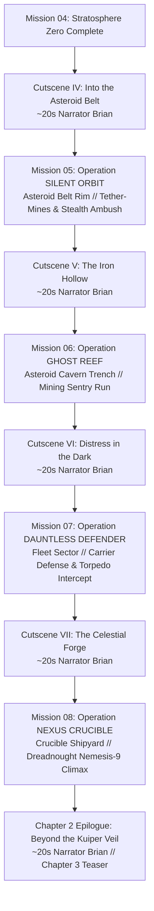

# 🚀 Project Vanguard: Chapter 2 — The Belt Invasion (Missions 05 – 08)

The second chapter of **Project Vanguard** takes the air war beyond planetary gravity into the cold vacuum of the **Gordian Asteroid Belt**. With the equatorial launch corridors secure, the Sol Orbital Directorate deploys the mobile super-carrier *SOC Dauntless* into deep space to locate and neutralize the Helion Combine's autonomous shipyard infrastructure.

---

## 🗺️ Chapter 2 Campaign Architecture & Cutscene Progression



---

## 🎬 Cinematic Interludes (Narrator: Brian)

Every transition between missions features an in-engine cinematic sequence rendered in 21:9 letterbox with dynamic 3D camera sweeps and Brian's official narration (`en-US-BrianNeural`, pitch: `-3Hz`, rate: `-4%`):

### 1. Interlude IV: Into the Asteroid Belt (`INT_M04_M05`)
* **Audio Track:** `godot_project/audio/narrator/interlude_04_asteroid_belt.mp3` (~19.5s)
* **Visuals:** Vanguard 1 flying in loose formation alongside the colossal *SOC Dauntless* as planetary blue gives way to dense fields of tumbling asteroids illuminated by a distant Sun.
* **Brian's Script:**
  > *"Beyond the Karman line, gravity releases its grip. The Sol Directorate launched the Dauntless into the Gordian Belt to sever the Combine's supply lines.*  
  > *Ahead lies a silent graveyard of stone and iron.*  
  > *Check your thrusters, Vanguard 1. Out here, there is no air to catch your fall."*

### 2. Interlude V: The Iron Hollow (`INT_M05_M06`)
* **Audio Track:** `godot_project/audio/narrator/interlude_05_iron_hollow.mp3` (~18.8s)
* **Visuals:** Camera tracks Vanguard 1 diving into the glowing thermal fissures of a massive hollowed nickel-iron asteroid (433-Eros), passing industrial smelting rigs.
* **Brian's Script:**
  > *"Telemetry from the perimeter probes unveiled the Combine's secret foundry.*  
  > *Deep within the hollowed heart of Asteroid Eros, automated smelters forge weapons in silence.*  
  > *Penetrate the excavation trench. Shatter their geothermal reactors, and burn your way back into the stars."*

### 3. Interlude VI: Distress in the Dark (`INT_M06_M07`)
* **Audio Track:** `godot_project/audio/narrator/interlude_06_distress_dark.mp3` (~19.2s)
* **Visuals:** Red combat alarms flash across the carrier flight deck. Flak bursts light up the black void as Combine heavy torpedo bombers close in on the carrier.
* **Brian's Script:**
  > *"The explosion inside Eros sent shockwaves through the belt. But the Combine retaliated without mercy.*  
  > *A wolfpack of heavy bombers has intercepted the Dauntless while her catapults were cold.*  
  > *All callsigns scramble! Protect the flagship, or the fleet dies in the dark."*

### 4. Interlude VII: The Celestial Forge (`INT_M07_M08`)
* **Audio Track:** `godot_project/audio/narrator/interlude_07_celestial_forge.mp3` (~20.0s)
* **Visuals:** Vanguard 1 ignites afterburners toward an immense orbital shipyard ring built around a shattered planetoid. Ahead looms the gargantuan Dreadnought *Nemesis-9*.
* **Brian's Script:**
  > *"The carrier stood her ground. Tracing the bombers' flight paths led directly to the Combine's command nexus: the Celestial Forge.*  
  > *Guarding the shipyard is their supreme flagship... the Dreadnought Nemesis-9.*  
  > *This is where their war machine ends, Ace. Strike the leviathan down."*

### 5. Chapter 2 Epilogue: Beyond the Kuiper Veil (`EPILOGUE_CH2`)
* **Audio Track:** `godot_project/audio/narrator/epilogue_chapter2_finale.mp3` (~20.2s)
* **Visuals:** The Dreadnought *Nemesis-9* erupts into a supernova of secondary explosions. Vanguard 1 banks away as the celestial shipyard disintegrates. In the far distance, deep beyond the outer Kuiper Belt, an ominous alien signal pulse flashes.
* **Brian's Script:**
  > *"The Nemesis-9 burned like a newborn star, scattering the Combine's fleet to dust.*  
  > *The Belt is liberated. Chapter Two is won.*  
  > *Yet as the dreadnought shattered, her black box transmitted one final quantum pulse toward the deep Kuiper Veil.*  
  > *Someone answered.*  
  > *Prepare your wings, Vanguard. Chapter Three will take us into the unknown."*

---

## ⚡ Mission 05: Operation "SILENT ORBIT"

```text
THEATER: Gordian Asteroid Belt Rim (Sector 24)
ENVIRONMENT: Deep Space Zero-G // Solar Backlight, Starfield, Tumbling Asteroid Screen
PLAYER CRAFT: F-77 Sculpted V-Hull Interceptor (Callsign: Vanguard 1)
STALL SPEED: 0.0 m/s (Vacuum Thruster Physics)
ARMAMENT: 4x VPSM-01 Strike Missiles, 20mm Internal Rotary Cannon (1,200 Rnds)
```

### 1. Narrative & Tactical Briefing
*SOC Dauntless* arrives at the perimeter of the Gordian Asteroid Belt. Helion stealth probes have deployed an automated network of tether-mines to block the carrier's orbital ingress vector. Vanguard 1 and wingman Miller are scrambled to sweep the corridor, destroying 4 tether-mine clusters and splashing 4 cloaked stealth skirmishers.

### 2. Tactical Objectives
* **Primary 1:** Maintain zero-G orientation and weave through dense asteroid debris.
* **Primary 2:** Destroy 4x Helion Tether-Mine Clusters (`asteroid_tether_mine.glb`).
* **Primary 3:** Neutralize 4x Helion Stealth Skirmishers (`drone_razor_skirmisher.glb`).
* **Secondary:** Destroy all mine clusters using cannon rounds only (conserve missiles).
* **Bonus:** Clear the perimeter screen without any asteroid collisions.

### 3. Diegetic Radio Script
* **Launch:**
  > **Apex Command (Christopher):** *"Vanguard 1, Apex Command. You are clear of the Dauntless hangar bay. Atmospheric seals disengaged—welcome to hard vacuum. Watch your RCS thrusters among those rocks."*  
  > **Aegis-7 (Sonia):** *"Orbital vacuum confirmed. Aerodynamic stall envelope disengaged. Inertial drift compensators online."*  
  > **Miller (Guy):** *"Look at this junk field, Lead. The Combine seeded the whole rim with magnetic tether-mines. One wrong move and they'll clamp right onto your hull."*
* **First Mine Cluster Destroyed:**
  > **Aegis-7:** *"Mine cluster eliminated. Proximity grid sector alpha clear."*  
  > **Apex Command:** *"Careful, Vanguard. Sensor signatures popping up on the radar disc—they're using the asteroid shadows to cloak!"*
* **Ambush Neutralized:**
  > **Miller:** *"Splash two! You got the others, Lead! Perimeter corridor is clean."*  
  > **Apex Command:** *"Good hunting, Vanguard Flight. Telemetry decoders just pulled coordinates to their internal foundry from those drone wreckage logs. Prep for cavern infiltration."*

---

## ⚡ Mission 06: Operation "GHOST REEF"

```text
THEATER: Hollow Interior of Asteroid 433-Eros ("The Iron Hollow")
ENVIRONMENT: Enclosed Asteroid Cavern // Molten Magma Vents, Metal Beams, Laser Grids
PLAYER CRAFT: F-77 Sculpted V-Hull Interceptor
CEILING / CLEARANCE: 140m Structural Envelope
ARMAMENT: 4x Strike Missiles, 20mm Rotary Cannon
```

### 1. Narrative & Tactical Briefing
Coordinates retrieved from Mission 05 lead directly into the interior of Asteroid 433-Eros. The Combine has hollowed out the asteroid's core to build an autonomous smelting facility. Vanguard 1 must fly into the excavation trench, dodge high-energy laser cutter grids, destroy 3 geothermal extraction generators, and rocket out before the reactor meltdown seals the shaft.

### 2. Tactical Objectives
* **Primary 1:** Infiltrate the hollow asteroid trench (Stay within the 140m structural ceiling).
* **Primary 2:** Destroy 3x Geothermal Extraction Generators powering the automated foundry.
* **Primary 3:** Neutralize 6x Automated Laser Sentries mounted along the cavern walls.
* **Failure Condition:** Crashing into cavern bulkheads or failing to escape before reactor containment collapse.

### 3. Diegetic Radio Script
* **Entering the Trench:**
  > **Apex Command:** *"Vanguard 1, telemetry is degrading as you enter the rock. You're entering the Iron Hollow. Keep your nose steady—clearance in that trench is less than one-hundred-fifty meters."*  
  > **Aegis-7:** *"Warning: Multiple automated laser cutting arrays active along cavern bulkheads. Recommend immediate evasive maneuvers."*
* **Generator Hit:**
  > **Vanguard 1:** *"Generator Alpha down! Secondary cooling loop rupturing!"*  
  > **Apex Command:** *"Two generators remaining! Keep moving, the facility is switching auxiliary power to automated sentry turrets!"*
* **Meltdown Triggered & Escape:**
  > **Aegis-7:** *"All three generators neutralized. Geothermal core destabilizing. Catastrophic thermal blowout in forty seconds."*  
  > **Apex Command:** *"Hit full afterburners, Vanguard 1! Get out of that rock before the shaft collapses!"*  
  > **Miller:** *"Punch it, Lead! I see your exhaust plume breaking through the exit fissure!"*

---

## ⚡ Mission 07: Operation "DAUNTLESS DEFENDER"

```text
THEATER: 5th Fleet Tactical Perimeter, Dauntless Staging Sector
ENVIRONMENT: Fleet Staging Orbit // Carrier Point-Defense Tracers, Anti-Ship Torpedoes
PLAYER CRAFT: F-77 Sculpted V-Hull Interceptor
WINGMAN: Lt. Vance Miller (Viper 2)
PROTECTED CAPITAL SHIP: Directorate Flagship "SOC Dauntless" (Hull: 1,000 / Shield: 600)
```

### 1. Narrative & Tactical Briefing
Enraged by the destruction of their foundry inside Eros, the Combine launches a decapitation counter-strike against the Directorate carrier *SOC Dauntless*. Heavy strike craft and automated gunboats deploy long-range anti-ship fusion torpedoes. Vanguard 1 and Miller must establish a close-in point defense perimeter, intercepting high-speed torpedoes in flight and neutralizing 3 waves of heavy strike bombers before the carrier's hull is breached.

### 2. Tactical Objectives
* **Primary 1:** Defend *SOC Dauntless* (Carrier Hull must not reach 0%).
* **Primary 2:** Intercept and destroy 8x Heavy Anti-Ship Fusion Torpedoes before they impact the carrier.
* **Primary 3:** Destroy all 3 assault waves (Wave 1: Skirmishers & Torpedoes, Wave 2: Heavy Gunboats, Wave 3: Saturation Strike).
* **Secondary:** Intercept at least 4 torpedoes with the rotary cannon.

### 3. Diegetic Radio Script
* **Carrier Under Siege:**
  > **Carrier Captain Ross (Andrew):** *"All stations, general quarters! Combine bombers jumping out of hyperspace on our port quarter! Flak batteries are tracking, but they've launched heavy torpedoes!"*  
  > **Apex Command:** *"Vanguard Flight, priority one is fleet defense! Those fusion torpedoes will crack the Dauntless's flight deck in two hits! Splash those warheads!"*  
  > **Miller:** *"Tally-ho on lead torpedo! Engaging with cannon!"*
* **Torpedo Warning:**
  > **Aegis-7:** *"EMERGENCY: High-velocity fusion torpedo detected on intercept course with Carrier Starboard Engine. Distance fifteen-hundred meters and closing fast!"*
* **Carrier Saved:**
  > **Captain Ross:** *"Direct hit on the final bomber! Air boss reports all torpedo tracks dissipated. Outstanding flying, Vanguard! The Dauntless owes you her life."*  
  > **Apex Command:** *"We tracked the carrier bombers' quantum telemetry trails back to their source: the Celestial Forge. Restock your ordnance, pilots. We're taking the fight to their front door."*

---

## ⚡ Mission 08: Operation "NEXUS CRUCIBLE"

```text
THEATER: The Celestial Forge (Combine Command Shipyard Ring)
ENVIRONMENT: Massive Shipyard Mega-Station Orbiting a Cracked Asteroid Core
PLAYER CRAFT: F-77 Sculpted V-Hull Interceptor
ADVERSARY BOSS: Helion Ironclad Dreadnought "NEMESIS-9"
COMMANDER: Helion Combine Warlord Vane (Callsign: "Iron Archon")
```

### 1. Narrative & Tactical Briefing
The climactic battle of Chapter 2. Vanguard Squadron assaults the Celestial Forge, the nerve center of Combine operations in the Asteroid Belt. Combine Warlord Vane undocks the unfinished dreadnought *NEMESIS-9* to personally annihilate Vanguard 1. The battle is a multi-phase boss fight:
- **Phase 1: Subsystem Stripping.** Destroy 4x Heavy Rotary Flak Pods mounted on the dreadnought's superstructure to weaken its defensive screen.
- **Phase 2: Shield Overload.** Destroy the twin Shield Generator Domes on the port and starboard ventral flanks.
- **Phase 3: The Thermal Core.** Execute a precision gun/missile strike into the exposed fusion reactor core while evading Warlord Vane's forward railgun barrage.

### 2. Tactical Objectives
* **Primary 1:** Infiltrate the Celestial Forge shipyard perimeter.
* **Primary 2:** Destroy 4x Dreadnought Rotary Flak Pods (Phase 1).
* **Primary 3:** Destroy 2x Ventral Shield Generators (Phase 2).
* **Primary 4:** Destroy Dreadnought *NEMESIS-9* by shattering its Exposed Reactor Core (Phase 3).
* **Secondary:** Eliminate the 4x Elite Guard fighters escorting the Dreadnought.

### 3. Diegetic Radio Script
* **Engaging the Dreadnought:**
  > **Apex Command:** *"There she is... the Nemesis-9. Look at the armor plating on that monster. Standard missile strikes won't penetrate that hull."*  
  > **Warlord Vane (Eric):** *"Directorate lapdogs. You bled for this rock, and here you shall be buried. Fire all flak batteries! Turn their composite hulls into slag!"*  
  > **Aegis-7:** *"Targeting system calibrated. Priority sub-systems tagged: Four rotary flak pods on upper deck."*
* **Flak Pods Destroyed:**
  > **Miller:** *"Upper flak turrets silenced! Her ventral shields are exposed, Lead! Hit those generator domes!"*  
  > **Warlord Vane:** *"Insolent gnats! Main railgun charged! Eradicate them!"*
* **Core Rupture & Victory:**
  > **Aegis-7:** *"Thermal core breached! Critical containment failure imminent!"*  
  > **Warlord Vane:** *"Impossible... My forge... my empire... CURSE YOU, VANGUARD!"*  
  > **Apex Command:** *"Confirmed! Dreadnought Nemesis-9 is detonating! The Celestial Forge is breaking apart! All Vanguard units, disengage and RTB! Chapter Two is ours!"*

---

## 🗂️ Chapter 2 Progression & Asset Matrix

| Mission | Codename | Environment & Sky | Primary Threat | Key Gameplay Innovations |
| :--- | :--- | :--- | :--- | :--- |
| **M05** | **SILENT ORBIT** | Asteroid Belt Rim (`deep_space_belt`) | Tether-Mines & Stealth Skirmishers | Zero-G physics ($0\text{ m/s}$ stall), Mine clearance, Asteroid slalom |
| **M06** | **GHOST REEF** | Hollow Cavern Trench (`asteroid_cavern`) | Geothermal Cores & Laser Sentries | Indoor 140m trench run, Laser evasion, Timed meltdown escape |
| **M07** | **DAUNTLESS DEFENDER** | Fleet Orbit (`carrier_orbit`) | Heavy Torpedo Bombers & Fusion Torpedoes | Capital ship escort, Fast torpedo interception, Multi-directional waves |
| **M08** | **NEXUS CRUCIBLE** | Shipyard Ring (`crucible_forge`) | Dreadnought *NEMESIS-9* Boss (Warlord Vane)| Multi-phase capital boss fight, Subsystem targeting, Railgun dodging |
