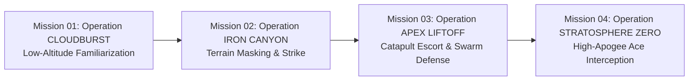

# 🎯 Project Vanguard: 4-Mission Campaign Plan

A fully realized, production-ready mission campaign designed around **strictly existing and parametrically generated assets**. Every airframe, weapon, HUD element, and environment structure references real models, scripts, and shaders already present in the Vanguard repository.

---

## 🗺️ Campaign Architecture & Asset Feasibility Matrix



### Studio Asset Feasibility Guarantee

| Asset Required | Source in Repository | Production Status |
| :--- | :--- | :--- |
| **Player Interceptor** | `godot_project/Spaceship_Sculpted_V_Hull.glb` | **Ready** (Rigged, Collisions, Sockets, PBR Materials) |
| **Strike Missile** | `godot_project/Vanguard_Strike_Missile.fbx` | **Ready** (4x Pylons mounted on fighter) |
| **Allied Wingman** | `assets/meshes/vehicles/Spaceship_Viper_Supreme_HD.fbx` | **Ready** (Faceted high-poly fighter) |
| **Enemy Drone Swarm** | `godot_project/target_drone.gd` | **Ready** (6-DOF evasion AI, hitboxes, radar blips) |
| **Enemy Ace Boss** | `assets/meshes/vehicles/Spaceship_Viper_Supreme_HD.fbx` with Crimson PBR override | **Ready** (Uses existing airframe in adversary livery) |
| **Ground Jamming Relays** | `assets/meshes/environment/Modular_SciFi_Wall_01_game_ready.fbx` + Panels | **Ready** (Modular 200cm snap assets assembled into antenna towers) |
| **Skyboxes & Atmospheres**| Godot 4 `ProceduralSkyMaterial` presets (Overcast, Dusk, Stratosphere) | **Ready** (Pure engine shaders, zero download cost) |
| **Combat Telemetry & HUD** | `godot_project/hud.gd` + `godot_project/combat_telemetry.gd` | **Ready** (Radar, Compass tape, Lock brackets, Shield/Hull vitals) |

---

## ⚡ Mission 01: Operation "CLOUDBURST"

```text
THEATER: Sub-Cloud Interception Sector 07 (Ascension Outpost Apex-Zero)
TIME / WEATHER: 0740 HRS // Heavy Overcast, Cloud Ceiling 2,800m, Moderate Turbulence
PLAYER CRAFT: F-77 Sculpted V-Hull Interceptor (Callsign: Vanguard 1)
ARMAMENT: 4x VPSM-01 Vanguard Strike Missiles, 20mm Internal Rotary Cannon (1,200 Rnds)
```

### 1. Narrative Context
At dawn, sensor arrays at high-altitude launch base *Apex-Zero* detect unauthorized telemetry signatures piercing the dense storm front. The Helion Combine has dispatched autonomous scout drones to probe the radar coverage of the equatorial launch corridors. With automated air defense batteries offline for scheduled maintenance, flight lead **Vanguard 1** is scrambled into the clouds.

### 2. Tactical Objectives
* **Primary 1:** Scramble from catapult, establish aerodynamic level flight above stall threshold ($>25\text{ m/s}$).
* **Primary 2:** Acquire and destroy 4x Helion Recon Drones (`target_drone.gd`) before they egress the sector.
* **Secondary:** Achieve 100% missile hit rate (zero missed Fox Three launches).
* **Bonus:** Splash all 4 bogeys in under 90 seconds.

### 3. Radio Comms & Diegetic Dialogue Script
* **Catapult Launch:**
  > **Apex Command (AWACS):** *"Vanguard 1, Apex Command on secure freq. Catapult pressure nominal. You are cleared for hot scramble. Cloud deck begins at two-thousand meters. Bogey vectors uploaded to your compass ribbon."*  
  > **Cockpit AI (Aegis-7):** *"Catapult release in three... two... one. Main thrusters engaged. Flight telemetry online."*
* **Target Acquisition:**
  > **Aegis-7:** *"Radar contact. Four hostile signatures on 350m disc. Bearing zero-four-five."*  
  > **Apex Command:** *"Hostiles confirmed autonomous Marauder drones. Weapons free, Vanguard 1. Show them the envelope belongs to the Directorate."*
* **First Missile Lock:**
  > **Aegis-7:** *"Target tracked. Locking... [1.4s beep tone] ...Solid lock confirmed on Station Two."*  
  > **Vanguard 1:** *"Fox Three away!"*
* **Mission Complete:**
  > **Apex Command:** *"Good splashes, Vanguard 1. All four signatures purged from the grid. Form up and RTB. Maintenance crews are prepping your ordnance for the next sortie."*

---

## ⚡ Mission 02: Operation "IRON CANYON"

```text
THEATER: The Red Sinks (Canyon Rift Complex, Sector 12)
TIME / WEATHER: 1720 HRS // Golden Dusk, Clear Skies, Deep Canyon Shadows
PLAYER CRAFT: F-77 Sculpted V-Hull Interceptor
ARMAMENT: 4x VPSM-01 Vanguard Strike Missiles, 20mm Rotary Cannon
```

### 1. Narrative Context
The reconnaissance drones from Mission 01 successfully deployed ground-based jamming repeaters along the floor of the Red Sinks canyon. The repeaters blind the Directorate's early-warning radars, leaving the orbital catapult exposed. To avoid high-altitude surface-to-air missile grids, Vanguard 1 must perform a high-speed low-altitude canyon run, hugging the terrain beneath 120 meters while destroying three modular transmitter relays.

### 2. Tactical Objectives
* **Primary 1:** Infiltrate the canyon corridor maintaining altitude below $120\text{ meters}$ (Terrain Masking).
* **Primary 2:** Destroy 3x Helion Jamming Relays (Stationary structures built from `Modular_SciFi_Wall_01`).
* **Primary 3:** Neutralize 4x Helion Patrol Drones defending the canyon rim.
* **Failure Condition:** Exceeding $180\text{m}$ altitude for more than 5 consecutive seconds triggers SAM barrage.

### 3. Gameplay Mechanics & Flight Dynamics
* **Terrain Navigation:** Pilots must bank hard through tight turns between towering rock pillars (`MeshInstance3D` terrain pillars from `main.tscn`), using airbrakes (`S` key) to avoid high-speed wall collisions without dropping into stall speed ($<25\text{ m/s}$).
* **Precision Gun Runs:** The stationary jamming towers are best engaged using the 20mm rotary autocannon to conserve strike missiles for airborne escort drones.

### 4. Radio Comms
* **Briefing:**
  > **Apex Command:** *"Vanguard 1, you're dropping into the Red Sinks. Keep your belly to the rock. If you pop above the canyon rim, Helion radar will light you up in seconds."*
* **Altitude Warning (If climbing too high):**
  > **Aegis-7:** *"CAUTION: Altitude 145 meters. Enemy tracking radar detected. Dive immediately."*
* **Relay Destroyed:**
  > **Apex Command:** *"Relay Alpha destroyed! Telemetry static clearing up. Two more to go, Vanguard."*

---

## ⚡ Mission 03: Operation "APEX LIFTOFF"

```text
THEATER: Equatorial Ascension Catapult Corridor
TIME / WEATHER: 0530 HRS // Dawn Horizon, Low Ground Fog, Sky Transitioning to Indigo
PLAYER CRAFT: F-77 Sculpted V-Hull Interceptor
WINGMAN: Lt. Vance Miller (Callsign: Viper 2, flying F-82 Viper Supreme HD)
PROTECTED TARGET: Directorate Heavy Transport "Olympus-4"
```

### 1. Narrative Context
The heavy orbital transport *Olympus-4*—carrying key satellite navigation cores—is spooling up along the 15-kilometer magnetic catapult rail for an emergency orbital ascension. The Helion Combine launches a desperate saturation strike, sending waves of autonomous drones to destroy the transport before it can reach escape velocity. Vanguard 1 and wingman **Viper 2** are assigned as the close-in combat air patrol (CAP).

### 2. Tactical Objectives
* **Primary 1:** Protect *Olympus-4* from incoming drone saturation waves (Transport Hull must remain $> 0\%$).
* **Primary 2:** Defend against Wave 1 (4x Fast Skirmishers), Wave 2 (6x Dive Drones), and Wave 3 (Heavy Interceptors).
* **Secondary:** Coordinate with wingman Viper 2 to destroy 3 bogeys simultaneously.
* **Bonus:** Clear Wave 2 without *Olympus-4* taking any shield damage.

### 3. Gameplay Mechanics
* **Capacitor & Distance Management:** Enemies spawn in directional quadrants (`North`, `East`, `Southwest`). The player must utilize the **Nitro Afterburner** (`SHIFT` key) to close 2-kilometer distances rapidly, while watching the Nitro Capacitor to prevent 3-second thermal lockouts.
* **Tactical Horizon Ribbon:** The player relies heavily on the top-center compass HUD tape and 350m polar radar disc to prioritize the hostiles closest to *Olympus-4*.

### 4. Radio Comms
* **Sortie Launch:**
  > **Viper 2 (Miller):** *"Vanguard 1, Miller on your right wing. Look at that bird... Olympus-4 is charging capacitors. Let's make sure she makes orbit."*  
  > **Apex Command:** *"Threat grid lit up like a Christmas tree! Wave one incoming bearing one-eight-zero, angels four. Intercept!"*
* **Transport Under Fire:**
  > **Olympus-4 (Captain):** *"Vanguard Flight, we're taking kinetic hits on starboard shields! Get these gnats off us!"*  
  > **Vanguard 1:** *"Engaging lead dive-bomber. Fox Three!"*
* **Ascension Success:**
  > **Olympus-4:** *"Main rocket ignition confirmed! Passing Mach 5 and climbing through fifty thousand feet. Thanks for the escort, Vanguard. We owe you a round at the station."*

---

## ⚡ Mission 04: Operation "STRATOSPHERE ZERO"

```text
THEATER: The Karman Boundary (Altitude: 42,000m - 55,000m)
TIME / WEATHER: 1200 HRS // Space Zenith (Black Starfield Above, Curving Planet Below)
PLAYER CRAFT: F-77 Sculpted V-Hull Interceptor
ADVERSARY ACE: Helion Strike Commander (Callsign: "Combine Ghost", flying F-82 Viper in Crimson Livery)
ARMAMENT: Maximum combat loadout (4x Strike Missiles + Full Cannon)
```

### 1. Narrative Context
Following the failed ambush on *Olympus-4*, telemetry traces reveal the swarm's control nexus: a high-apogee command fighter nicknamed the **"Combine Ghost"** cruising in the mesosphere above 45,000 meters. Vanguard 1 executes a maximum-thrust zoom climb into the upper stratosphere to eliminate the enemy flight commander and shatter the Helion drone control mesh once and for all.

### 2. Tactical Objectives
* **Primary 1:** Intercept the Helion Command Fighter (`Spaceship_Viper_Supreme_HD` Crimson Boss) at high apogee.
* **Primary 2:** Defeat the 4x Elite Escort Drones flying in diamond formation.
* **Primary 3:** Shoot down Combine Ghost in single-combat energy dogfight.
* **Secondary:** Neutralize Combine Ghost within 3 minutes of engagement.

### 3. Flight Physics Twist: High-Altitude Thin Atmosphere
* **Reduced Wing Lift:** At $45,000\text{m}$, air density is less than $15\%$ of sea level. Stall speed increases to $45\text{ m/s}$.
* **Energy Vectoring:** Pilots cannot rely on wide banked turns; dogfighting requires high-thrust zoom-and-dive maneuvers, relying on nitro thruster bursts and zero-G inertia to snap the nose onto target.

### 4. Radio Comms & Climax
* **Zoom Climb into Vacuum:**
  > **Apex Command:** *"Vanguard 1, you are crossing forty thousand meters. Skies are turning black. Aerodynamic control surfaces decaying—you are on vectoring thrusters now."*  
  > **Aegis-7:** *"Atmospheric pressure minimal. Lift coefficient reduced eighty-five percent. Stall warning threshold adjusted to forty-five meters per second."*
* **Contact with the Boss:**
  > **Apex Command:** *"Radar contact! It's the Combine Ghost. He's spotted you and turning in hot!"*  
  > **Combine Ghost (Adversary):** *"So the Directorate sent their prized pilot to freeze in the vacuum. Let's see how your precious V-hull handles true zero-G!"*
* **Boss Defeated:**
  > **Aegis-7:** *"Catastrophic core rupture on target. Threat destroyed."*  
  > **Apex Command:** *"Combine Ghost is down! The entire drone swarm network is shutting down across the hemisphere! Outstanding work, Vanguard 1... You just saved the Ascension Corridors. Return to base, Ace."*

---

## 🗂️ Campaign Progression Summary

| Mission | Name | Key Mechanics Learned | Primary Environment | Primary Threat |
| :--- | :--- | :--- | :--- | :--- |
| **01** | **CLOUDBURST** | Flight basics, Stall Envelope ($25\text{ m/s}$), Radar lock ($1.4\text{s}$), Fox Three firing | Stormy Cloud Deck | 4x Recon Drones |
| **02** | **IRON CANYON** | Terrain hugging ($<120\text{m}$), Airbraking (`S`), Precision 20mm Cannon runs | Deep Red Rock Canyon | 3x Ground Jamming Relays + Canyon Patrols |
| **03** | **APEX LIFTOFF**| Asset defense, Nitro capacitor management (`SHIFT`), Compass target tracking | Dawn Catapult Facility | 3 Waves of Dive-Bomber Swarm Drones |
| **04** | **STRATOSPHERE ZERO** | High-altitude thin-air energy flight, Post-stall maneuvering, Boss dogfight | Karman Boundary / Black Space | Helion Ace Commander in Crimson Viper |
