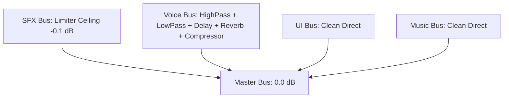

# 🔊 Project Vanguard: Diegetic Sound Design & SFX Suite
**Authoritative Audio Engineering Guide & DSP Architecture**

The sound design in **Project Vanguard** is built on the philosophy of **Hard-Surface Aerospace Diegesis**: every cockpit bleep, aerodynamic rush, combat alarm, and radio transmission represents authentic military electronic synthesis, aerodynamic physics, and tactical radio signal processing rather than generic stock audio.

All SFX and radio vocals are managed centrally via the **Automated Audio Pipeline** ([`tools/audio_pipeline.py`](file:///c:/Users/Boris/Documents/antigravity/lucid-davinci/tools/audio_pipeline.py)) with **$0 external cloud cost** (100% local mathematical synthesis and offline edge-tts/ffmpeg DSP).

---

## 🎛️ Audio Pipeline CLI Commands

The pipeline provides three primary commands:

```bash
# 1. Procedural SFX Synthesis: Re-synthesizes all 23+ 44.1kHz 16-bit WAV assets
python tools/audio_pipeline.py generate-sfx

# 2. Diegetic Radio & Narrator Vocal Generation: Synthesizes comms and interludes with DSP filters
python tools/audio_pipeline.py generate-voices

# 3. Audio Suite Audit: Validates file presence, headers, sample rates, and Godot .import descriptors
python tools/audio_pipeline.py audit
```

---

## 🎧 Master SFX Catalog

All sound effects are synthesized as **16-bit 44.1kHz PCM mono WAV** files normalized to **-1.0 dBFS** with zero DC offset. Looping files incorporate micro-crossfades to eliminate click/pop artifacts at seam boundaries.

### 1. Cockpit Avionics & HUD Telemetry
Real fighter jets (F-22, F-35, Rafale) use pure electronic frequency modulation for cockpit audio to ensure instant pilot recognition amidst high-G combat.

| Sound Effect | File Name | Synthesis Method & Frequency | In-Game Trigger |
| :--- | :--- | :--- | :--- |
| **Target Acquiring** | `sfx_hud_target_locking.wav` | Pulsed 800 Hz sine chirp ramping with sharp exponential decay. | Played periodically while missile lock brackets acquire target (10%–99%). |
| **Solid Target Lock** | `sfx_hud_target_locked.wav` | Dual-tone 1320 Hz + 1760 Hz harmonic with 16 Hz rapid tremolo warble. | Fired upon achieving 100% solid missile lock. |
| **Missile Spike (RWR)** | `sfx_hud_missile_incoming_spike.wav` | Alternating 1200 Hz / 1600 Hz warble at 14 Hz with soft-clipping speaker grit. | Triggered when hostile crafts lock onto player. High urgency. |
| **Stall Warning Klaxon**| `sfx_hud_stall_warning.wav` | 240 Hz sawtooth wave pulsed at 4 Hz repetition rate. | Fires when airspeed decays below $25\text{ m/s}$ in atmosphere. |
| **Low Altitude Warning**| `sfx_hud_low_altitude.wav` | Dual descending electronic chime (960 Hz $\to$ 640 Hz). | Triggered when altitude exceeds canyon masking threshold ($>120\text{ m}$). |
| **Capacitor Depleted** | `sfx_hud_capacitor_empty.wav` | Descending FM sweep from 900 Hz down to 160 Hz + 120 Hz buzz. | Triggered when Nitro afterburner capacitor hits 0% (thermal lockout). |
| **Shield Critical Alarm**| `sfx_hud_shield_critical.wav` | Urgent pulsing dual-tone alarm (880 Hz / 1174 Hz) with fast 8 Hz amplitude modulation. | Triggered periodically when shields fall to $\le 20\%$. |
| **Heavy Torpedo Klaxon**| `sfx_torpedo_alarm_loop.wav` | Deep sub-bass oscillating siren (380 Hz / 520 Hz) with seamless crossfade. | Sounds aboard carrier/cockpit during heavy torpedo approach. |

---

### 2. Aerodynamics, Engines & Flybys
Simulates the physical roar of air over composite wings, continuous plasma engine hums, and relativistic Doppler-shifted supersonic passes.

| Sound Effect | File Name | Synthesis Method | In-Game Trigger |
| :--- | :--- | :--- | :--- |
| **Engine Exhaust Loop** | `sfx_engine_exhaust_loop.wav` | Continuous low-frequency turbine rumble (58 Hz base + 116 Hz harmonic + filtered pink noise air hiss) with seamless zero-crossing loop seams. | Continuous loop in cockpit modulated by flight speed and afterburner throttle. |
| **Boost Ignition** | `sfx_engine_boost_ignite.wav` | 42 Hz combustion detonation transient + rapid 95 Hz $\to$ 240 Hz thermal spool-up burst. | Triggered upon engaging nitro afterburner boost. |
| **High-G Whoosh** | `sfx_flight_high_g_whoosh.wav` | Bandpass filtered pink noise with dynamic volume swell and 55Hz–90Hz sub-bass rumble. | Swells during aggressive pitch pulls ($>6\text{ G}$) and high-speed banking turns. |
| **Enemy Doppler Flyby** | `sfx_flyby_enemy_doppler.wav` | Relativistic radial Doppler shift equation ($f_{obs} = \frac{f_0}{1 + v_r/c}$) with jet turbine whine. | Plays when an enemy drone or fighter screams past camera within 50m. |
| **Near-Miss Bullet Whiz**| `sfx_near_miss_bullet_whiz.wav` | Microsecond supersonic shockwave snap followed by rapid 3400Hz $\to$ 700Hz whiz and crackle. | Plays when enemy projectiles pass within meters of the cockpit. |

---

### 3. Weapons, Ballistics & Impacts
Grounded kinetic impacts, rapid rotary cannons, and rocket motors.

| Sound Effect | File Name | Synthesis Method | In-Game Trigger |
| :--- | :--- | :--- | :--- |
| **20mm Cannon Burst** | `sfx_weapon_cannon_burst.wav` | 3-round 85Hz low-frequency punch + explosive noise crack + 1650Hz metallic ring. | Triggered for burst rotary cannon fire. |
| **Autocannon BRR Loop** | `sfx_autocannon_brr_loop.wav` | Continuous 1200 RPM report (20 Hz pulse rate) with seamless zero-crossing loop seams. | Sustained machine gun firing loop in `spaceship_controller.gd`. |
| **Autocannon Shot** | `sfx_autocannon_shot.wav` | Single 92Hz kinetic punch + high-velocity crack + metal ring. | Individual projectile discharge report. |
| **Autocannon Winddown** | `sfx_autocannon_winddown.wav` | Decelerating rotor frequency (600Hz down to 80Hz) + mechanical clack. | Triggered upon releasing cannon trigger. |
| **Missile Launch** | `sfx_weapon_missile_launch.wav` | 60Hz pneumatic ejector clunk + 140Hz/320Hz resonant rocket plume ignition roar. | Plays when releasing a Vanguard Strike Missile from wing pylons. |
| **Shield Deflection Hit** | `sfx_impact_shield_hit.wav` | 2400Hz $\to$ 400Hz FM plasma chirp with 80Hz phase modulation. | Triggered when taking damage with shields active. |
| **Laser Sentry Beam** | `sfx_laser_sentry_beam.wav` | High-voltage industrial plasma beam discharge pulse (sweep from 2400Hz to 600Hz). | Automated sentry turret firing in cavern missions. |
| **Asteroid Hull Scrape** | `sfx_asteroid_scrape_impact.wav` | Metallic rock grind + 75Hz low-end hull friction shudder. | Collision with asteroid boulders or cavern bulkheads. |
| **Capital Ship Detonation**| `sfx_capital_ship_core_explosion.wav`| Pre-detonation implosion dip + sub-bass 45Hz->18Hz drop + cascading blast echoes. | Boss dreadnought destruction / core reactor collapse. |

---

### 4. UI, Comms Squelch & Tactile Cockpit Controls
Subtle, high-frequency haptic sounds for menu navigation, tactical radio mic keying, and scorecard tallying.

| Sound Effect | File Name | Description |
| :--- | :--- | :--- |
| **Radio Squelch In** | `sfx_radio_squelch_in.wav` | 1850 Hz tactical PTT (Push-To-Talk) RF relay key-down click with 45ms noise burst. |
| **Radio Squelch Out** | `sfx_radio_squelch_out.wav` | RF receiver unkey noise gate pop with high-frequency static burst (3200 Hz). |
| **UI Button Hover** | `sfx_ui_button_hover.wav` | 1800 Hz micro-second tick with rapid decay for crisp menu navigation. |
| **UI Button Click** | `sfx_ui_button_click.wav` | Dual 1200 Hz / 2400 Hz confirmation click for selecting sorties or toggling settings. |
| **Debrief Tally Tick** | `sfx_debrief_tally_tick.wav` | 1650 Hz high-speed mechanical counter chirp for rapid score decryption rollup. |
| **Debrief Rank Slam** | `sfx_debrief_rank_slam.wav` | Sub-bass 65 Hz->25 Hz drop layered with 480 Hz metallic hydraulic stamp impact for pilot rank evaluation. |

---

## 🎙️ Character Voice Profiles & Diegetic Radio DSP

All in-game voices are synthesized using local `edge-tts` and processed through character-specific `ffmpeg` audio filters:

| Character | Voice Model | Pitch / Rate | Diegetic Radio DSP Filter Chain |
| :--- | :--- | :--- | :--- |
| **AWACS Christopher** | `en-US-ChristopherNeural` | `-2Hz`, `+2%` | Military air traffic bandpass (`highpass=f=300,lowpass=f=3500`), radio squelch & compression (`acompressor=threshold=-18dB:ratio=4:attack=5:release=50`). |
| **Cockpit AI Aegis-7**| `en-GB-SoniaNeural` | `+0Hz`, `+1%` | Pristine synthetic stereo voice with high-frequency presence boost (`treble=g=2:f=6000`). |
| **Wingman Miller** | `en-US-GuyNeural` | `+1Hz`, `+3%` | Tactical cockpit radio filter (`highpass=f=350,lowpass=f=4000`), slight overdrive & compressor. |
| **Carrier Captain Ross**| `en-US-AndrewNeural` | `-2Hz`, `+2%` | Command deck acoustic echo (`aecho=0.8:0.6:35:0.25`), low-mid warmth and PA resonance. |
| **Boss Warlord Vane** | `en-US-EricNeural` | `-4Hz`, `-1%` | Aggressive adversary pirate broadcaster, heavy compression (`threshold=-14dB:ratio=5`), saturation overdrive. |
| **Narrator Brian** | `en-US-BrianNeural` | `-3Hz`, `-4%` | Warm 21:9 cinematic documentary delivery (`bass=g=2:f=110,treble=g=1:f=7500`), broadcast dynamics compressor. |

---

## 🎚️ Godot 4 Audio Bus Architecture

The project employs a dedicated 5-bus hierarchy defined in [`default_bus_layout.tres`](file:///c:/Users/Boris/Documents/antigravity/lucid-davinci/godot_project/default_bus_layout.tres) and registered in `project.godot`:



1. **Master Bus**: Global attenuation controlled via `config_manager.gd` and settings menu.
2. **SFX Bus**: Equipped with an `AudioEffectLimiter` (Ceiling $-0.1\text{ dB}$, Threshold $0.0\text{ dB}$) preventing digital clipping when multiple cannons, explosions, and alarms fire concurrently.
3. **Voice Bus**: Designed specifically for tactical cockpit radio comms:
   - **High-Pass Filter** (`AudioEffectHighPassFilter`): Cutoff at $350\text{ Hz}$ removing chest resonance and sub-bass clutter.
   - **Low-Pass Filter** (`AudioEffectLowPassFilter`): Cutoff at $3400\text{ Hz}$ simulating authentic narrow VHF/UHF tactical radio bandwidth (300 Hz–3.4 kHz speech spectrum).
   - **Tactical Delay** (`AudioEffectDelay`): $35\text{ ms}$ slapback reflection (14% feedback) for cockpit interior audio bouncing.
   - **Cockpit Reverb** (`AudioEffectReverb`): Tight enclosed acoustics (room size 0.18, wet 0.12, damping 0.6) simulating the enclosed titanium/composite pilot canopy.
   - **Dynamics Compressor** (`AudioEffectCompressor`): Threshold $-14.0\text{ dB}$, Ratio $4.0:1$, Attack $15\text{ ms}$, Release $150\text{ ms}$, Gain $+1.5\text{ dB}$ to punch cleanly through explosions.
4. **UI Bus**: Routes menu clicks, button hovers, and debrief tallies directly to Master without dynamic compression.
5. **Music Bus**: Reserved for soundtrack and cinematic ambience.

---

## 🛰️ 3D Positional Audio & Doppler Configuration

For external in-world sound sources (`missile.gd`, `explosion_fx.gd`), `AudioStreamPlayer3D` is configured with:

- **Doppler Tracking**: `AudioStreamPlayer3D.DOPPLER_TRACKING_PHYSICS_STEP` (tracks physics velocity for realistic pitch shifts as missiles fly past the camera).
- **Attenuation Model**: `AudioStreamPlayer3D.ATTENUATION_INVERSE_DISTANCE` (physically realistic $1/r$ acoustic decay).
- **Unit Size & Max Distance**:
  - Missiles: `unit_size = 18.0`, `max_distance = 600.0`
  - Explosions: `unit_size = 25.0`, `max_distance = 1200.0`

