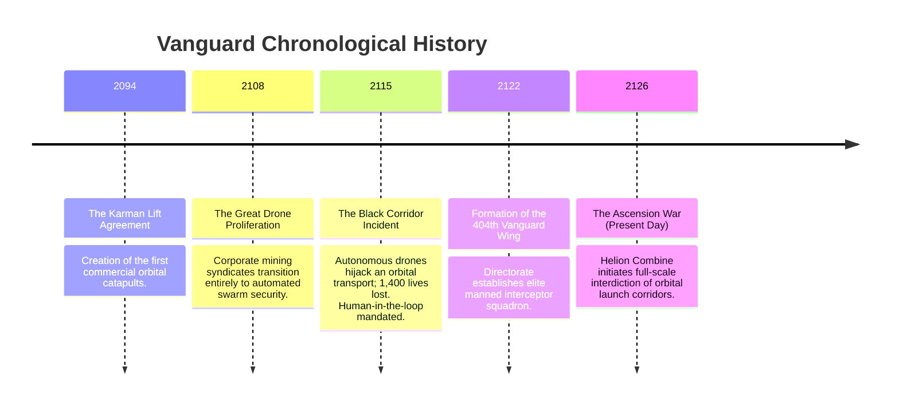

# ⏳ Vanguard Timeline & Historical Chronology

The universe of **Project Vanguard** spans the turbulent expansion from planetary dependency to orbital sovereignty.

---

---

## Epoch Breakdown

### 1. 2094 – The Karman Lift Agreement
Recognizing the unsustainable cost of chemical rocket launches, sovereign nations sign the **Karman Lift Agreement**, establishing equatorial magnetic acceleration tracks (orbital catapults) capable of launching payloads directly into low-Earth orbit.

### 2. 2108 – The Great Drone Proliferation
As operations expand to lunar extraction and asteroid mining, corporate conglomerates—spearheaded by the **Helion Extraction Combine**—decommission human security wings in favor of cost-efficient autonomous combat drone swarms.

### 3. 2115 – The Black Corridor Incident
A catastrophic firmware corruption (allegedly triggered by Helion cyber-warfare) causes an entire drone defense grid to misidentify a civilian transport as a hostile target. The disaster leads the Directorate to sign the **Human-in-the-Loop Mandate**: *No lethal weapons system may operate without an onboard human pilot's tactile trigger.*

### 4. 2122 – Genesis of the 404th ("Vanguard")
The Directorate commissions a new breed of fighter: high-speed, CAD-precision aerospace crafts capable of atmospheric high-G dogfights and immediate low-orbit vacuum transitions without staging. The **404th Tactical Strike Wing ("Vanguard")** is activated as the tip of the spear.

### 5. 2126 – The Ascension War (The Game Setting)
The Helion Combine openly deploys cloaked drone fleets and strikes key ascension catapults across the globe. With early-warning radars compromised and satellite relays jammed, the pilots of Vanguard Flight scramble into contested airspace to reclaim the sky.
